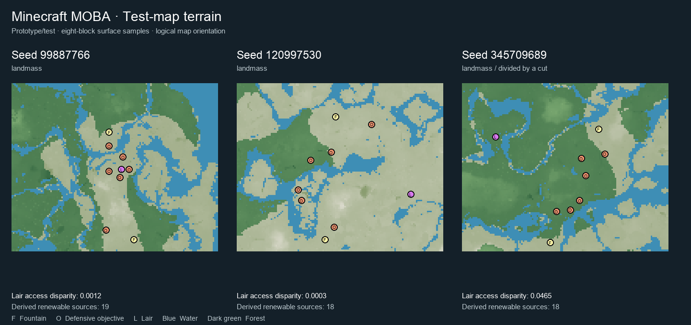

# Seed reevaluation results — 2 October 2026

**Prototype/test.** Three authored maps from eight generated seed/location pairs. Sixteen seeds screened; 265,280 candidate windows considered; 167 eligible locations. The three successes are distinct seeds, including fresh seed 345709689. This small, selected batch is not a population yield estimate or competitive play-balance proof.

| Seed | Scout labels | Lair access disparity A_L | Renewable sources | Inspection ZIP (local only) |
|---|---|---:|---:|---|
| 99887766 | landmass | 0.0012 | 19 | `MOBA_Test_99887766-67b6de0290.zip` |
| 120997530 | landmass | 0.0003 | 18 | `MOBA_Test_120997530-d40a007ffe.zip` |
| 345709689 | landmass, divided_by_a_cut | 0.0465 | 18 | `MOBA_Test_345709689-c4bc55b6b9.zip` |

The inspection ZIPs live in `artifacts/worldgen/seed_reevaluation_2026-10-02/packages/`,
which is deliberately **not committed** — see `.gitignore`. The filenames are given
so a local copy can be identified; they will not resolve in a fresh clone.

A_L is the relative difference in measured terrain-graph access cost between teams. The current provisional bound is 0.15; it does not establish encounter quality or overall competitive balance. Scout labels describe off-seed terrain and are not independently certified gameplay Map Types.

## Rejected locations

| Seed | Result |
|---|---|
| 2718281 | SOCKET_NOT_INDEPENDENTLY_ACCEPTABLE |
| 31337 | OPENING_CEILING_VIOLATED |
| 930016664 | LAIR_PHYSICALLY_INVALID |
| 930015734 | SOCKET_NOT_INDEPENDENTLY_ACCEPTABLE |
| 1454639558 | SOCKET_NOT_INDEPENDENTLY_ACCEPTABLE |

The Lair rejection on 930016664 was a spruce-leaf obstruction at its occupant spawn anchor. The village-opening rejection and independently unacceptable Homebase sockets remain rejections. None of the acceptance thresholds were relaxed.

## Verification

- Initial full worldgen suite: 617 passed. After the tooling fixes: 620 passed; focused exact-scan and entity-clearance tests also passed.
- Each accepted map passed the encoded compiler, authored-block readback, runtime readiness, and saved-world trial-chamber exclusion checks.
- Inspection ZIPs have separate creative-mode worlds, commands enabled, north-Fountain spawn coordinates, and void generation outside saved chunks. Their source pool worlds remain untouched.
- `server-smoke.json` records independent official-server boots and real-engine checks of both Fountain plinths and source-water blocks for each inspection world.
- No actual player match was run in this batch. MOBA gameplay requires the plugin and the generated pool bindings. Art/encounter quality and competitive balance remain for playtesting.

## Tooling repairs made during reevaluation

1. Entity eviction now uses the existing optional-entity-region reader: a zero-byte vanilla placeholder is accepted; a nonempty truncated region still fails. This repaired an actual authoring exception on 99887766.
2. Full sections inside one measurement cell use exact packed-palette histograms. Clipped/strided sections retain per-block evaluation; chunks wholly outside the selection bounds are skipped. The shortcut preserves ore and vegetation counts, cell boundaries and source hashes.
3. On a real 128×128-block terrain sample, the histogram and scalar scan returned identical outputs; measured times were 5.360 s and 1.424 s (3.76×). Both comparison paths included the outside-chunk skip.

`evaluation-source-hashes.json` pins the uncommitted evaluation code and test datapack, in addition to the Git head and pinned official server jar in `summary.json`. Scripts, generation overrides, evidence, source worlds, authored worlds, isolated pool, and inspection packages are kept in separate directories.

## Inspection

Extract a ZIP so its `MOBA_Test_*` folder sits inside Minecraft’s `saves` directory, then open it in **Minecraft Java 1.21.11**. Use creative flight or `/gamemode spectator`. Each world’s `INSPECTION.json` contains teleport coordinates and runtime bindings. The same authored maps are also retained in the isolated `artifacts/worldgen/seed_reevaluation_2026-10-02/test-pool/` for later plugin playtests.

