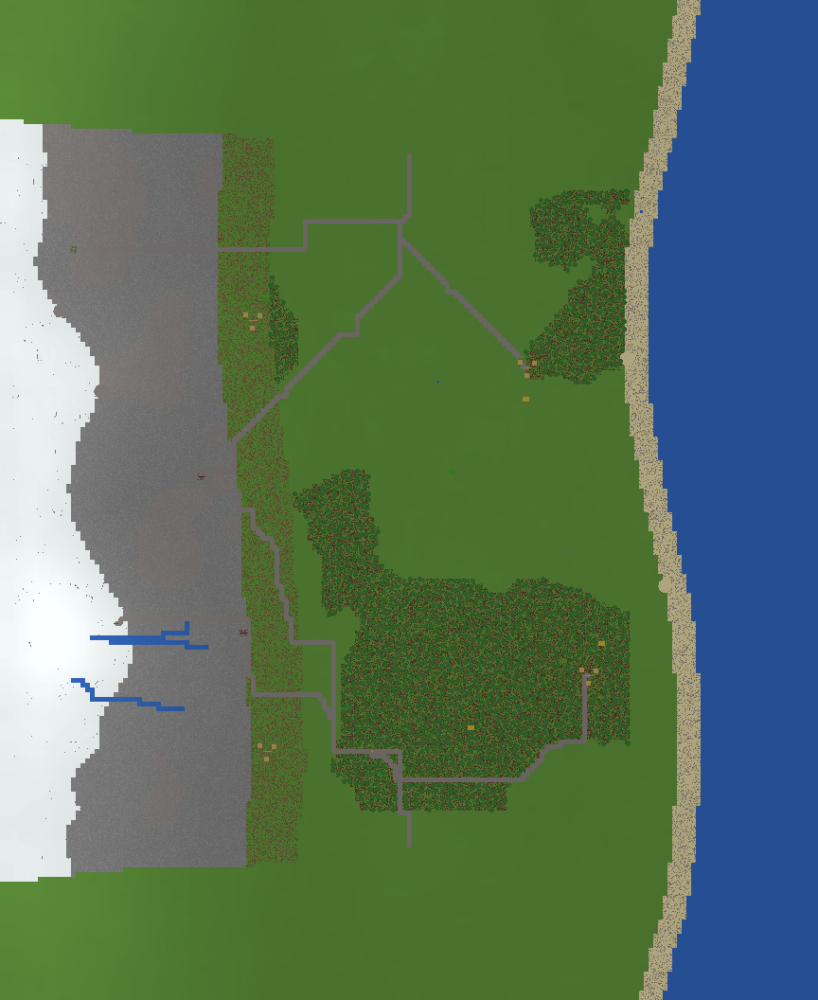
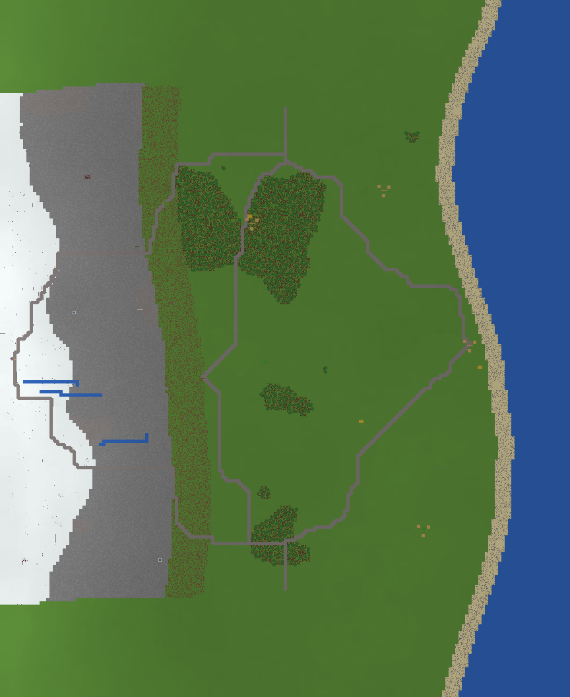

# Serialized Default finalist comparison

> Status: prototype/test evidence. This report does not select the final Default
> map. It compares two translations made by the same serializer.

## Build contract

- Minecraft Java 1.21.11, DataVersion 4671.
- Direct modern Anvil/NBT block and entity-region serialization.
- `level.dat` schema bootstrapped from the matching official Mojang server.
- Analytical envelope padded only to complete chunks: X -432..431, Z -528..527
  (3,564 chunks per world); authored Y range -64..127.
- Candidate seeds are not passed through vanilla world generation.
- The official server JAR SHA-1 is pinned to
  `64bb6d763bed0a9f1d632ec347938594144943ed`.
- Both generated packages booted, reached `Done`, saved, and stopped cleanly in
  the official server. No serious load, chunk, palette, entity, or version
  message was reported.

The temporary palette is intentionally restrained. Routes are dirt path and
gravel with simple plank decks where needed; they are readable inspection
geometry, not the final Route language. Villages are small three-house
settlements with beds and villagers. POIs are compact Minecraft-legible
placeholders. Ores are buried or cave-linked according to metadata, rather than
raised as debug monuments.

## Side-by-side evidence

| Serialized observation | 920261010 — horseshoe | 920261022 — offset_basin |
|---|---:|---:|
| Spawn | 0, 65, -365 | 0, 63, -365 |
| Read-back chunks | 3,564 / 3,564 | 3,564 / 3,564 |
| Surface height range | 59–114 | 59–107 |
| Candidate anchor max / mean delta | 1 / 0.159 blocks | 1 / 0.169 blocks |
| Adjacent surface edges over 8 blocks | 0 | 0 |
| Physical Route coverage | all six 100% | five 100%; N1 99.69% |
| Drainage read-back | 3/3 connected; no uphill artifacts | 3/3 connected; no uphill artifacts |
| Trees | 1,358 | 559 |
| Entities | 63 | 63 |
| Horses / cows / sheep / pigs / chickens | 9 / 10 / 8 / 14 / 14 | 10 / 8 / 10 / 12 / 15 |
| Villagers | 8 | 8 |
| Route terrain correction | 4,839 columns, at most 1 Y | 7,304 columns, at most 1 Y |

Both read-back audits found every required physical ore, sand, gravel, snow,
crop, water, livestock, and horse identifier. Both have valid air-above-solid
spawns, complete terrain regions, ocean/coast blocks, surviving western depth,
and no serialization-induced vertical walls. Detailed evidence is in each
seed's `validation_report.json`, `server_compatibility.json`, and
`serialization_manifest.json`.

## 920261010 — horseshoe

The world is recognizably Minecraft at the block vocabulary and local-feature
level: it has varied surface materials, dense irregularly spaced trees,
animals, farms, small settlements, POIs, caves, and traversable roads. Its
horseshoe mountain is the clearer geographic identity of the pair. The taller
snow field and enclosing ridge/basin relationship survive serialization, and
the three forest regions produce genuinely substantial interiors.

At whole-map scale, however, the mountain does not yet read fully as natural
Minecraft geography. The very broad snow, rock, and forest transition masks
remain conspicuous bands, with long near-straight boundaries. The underlying
heightfield is smoothly traversable and avoids giant walls, but the macro
surface can read as a designed obstacle or low-resolution terrace rather than
layered geology. The short western drainage networks remain connected and
downhill, yet look narrow and rectilinear and do not develop convincing visible
catchments or terminal basins. The east coast is coherent and gently variable,
but its nearly uniform sand ribbon is more schematic than a natural beach.

The large southern forest makes the south Route fan visually and strategically
interesting: south Route branches cross 156, 156, and 273 analytical forest
columns, with several grade changes. North travel is much more open. This is a
useful contrast, but it may make the candidate feel less balanced in lived
visibility and discovery order than its 0.054 analytical opportunity-bias score
suggested. Villages and POIs are embedded rather than monumental, although the
temporary settlements are too small to judge developable-space quality from
the overview alone. Empty central land gives strong separation, but whether it
feels spacious or merely under-articulated requires in-game travel.

## 920261022 — offset_basin

This world is also recognizably Minecraft locally, but it is much more open.
The offset basin and large Route enclosure remain clearly different from the
horseshoe. Its lower mountain and sparser, fragmented forests expose Route
divergence and coast approaches more legibly. The analytical prediction of
greater coast variation survives as a more noticeably wandering shore, though
the same narrow sand treatment still turns that variation into a band rather
than beach/headland/estuary geography.

The basin reads at overview scale, but the mountain transition has the same
large straight material boundaries and smooth macro grading as the control.
Its three drainage systems pass connectivity and downhill checks but remain too
short and rectilinear to sell catchment-scale hydrology. Forest patches have
real interiors and irregular tree spacing; their outer masks are abrupt, and
559 trees versus 1,358 makes this candidate substantially less wooded than the
control. Its open middle preserves the intended 47.2% empty connective space,
but makes the unresolved question of useful emptiness especially visible.

The Route system is longer and more enclosing. Four branches require explicit
grade/forest review; north Route 1 contains eight analytical segments with
greater-than-one-block rises and retained 99.69% physical coverage. The
temporary surface stays traversable, but long straight runs, right-angle bends,
and the encircling topology look strongly diagrammatic. This confirms the
analytical prediction of higher Route dependence (mean Route share 0.363), while
showing that dependence will also be a strong visual fact. Villages and POIs
sit plausibly within open geography but currently lack enough local landscape
response to feel like places rather than small inserted features.

## What block translation changed—or revealed

### Generator/model problems

- Macro terrain and ecology masks are too legible: westward material bands,
  abrupt forest edges, and very broad smooth gradients need more multiscale
  internal structure before either candidate becomes a polished prototype.
- Route polylines contain overly straight runs and angular turns. This is source
  topology resolution, not a block-writer failure.
- Drainage passes the analytical and block connectivity tests but is visually
  underdeveloped: narrow stair-step streams do not establish catchments,
  tributaries, floodplains, lakes, or credible coastal mouths.
- Coast variation as a scalar did not predict coastline quality. Both coasts
  remain uniform ribbons despite 59 versus 91 blocks of analytical variation.
- Analytical opportunity/fairness scores do not measure lived visibility,
  forest enclosure, skyline legibility, or how empty terrain feels over time.

### Serialization problems fixed in this pass

- Bilinear expansion plus deterministic one-block breakup prevents exposed
  five-block sampling facets without moving analytical anchors materially.
- Homeland and village footprints are locally leveled and blended. Every
  adjustment and maximum Y delta is recorded; no unreported geometry repair was
  made.
- Route centerlines are step-traversable with a four-block blended apron. The
  largest Route correction in either world is one Y block.
- Water crossings preserve water below temporary plank decks rather than
  replacing the drainage channel.
- The oblique inspection renderer's sampling gaps were corrected. This was a
  render-only defect.
- The build now rejects a mismatched server JAR, and the block output is audited
  after Anvil serialization rather than inferred from input metadata.

### Temporary palette/representation limitations

- One restrained Route palette exaggerates the polylines' diagrammatic quality.
- Surface renders cannot show buried ore separation or cave experience; those
  need spectator/in-game inspection.
- Small generic villages/POIs establish location and approach only. They are not
  evidence for final architecture, objective scale, or settlement balance.
- All trees use a compact oak implementation. Forest geometry is reviewable,
  but biome/ecological identity is not final.

### Unresolved gameplay questions

- Whether the large connective center reads as strategic breathing room or as
  excessive emptiness.
- Whether the horseshoe's asymmetric forest enclosure is fair in discovery and
  retreat play despite strong analytical portfolio balance.
- Whether the offset basin's enclosing Routes create meaningful expeditions or
  excessive Route dependence.
- Actual travel feel, sight lines, cave navigation, combat/build usability, and
  round-trip Hunger consequences cannot be settled by block read-back or these
  renders.

## Route grammar evidence for the next milestone

The serialized worlds expose a need for distinct, terrain-adaptive segment
types: open-ground straights; eased bends instead of right angles; forks and
junction plazas; forest-entry transitions; enclosed forest passages and
clearings; graded ascents; stepped or switchback mountain approaches; ridge and
saddle traverses; cut/fill edges; stream culverts and small bridges; coastal
approaches; and village/POI arrival segments. Horseshoe is the stronger forest
passage and mountain-transition test. Offset basin is the stronger long-grade,
enclosing-Route, junction, and coast-approach test.

## Decision point

Both deserve targeted in-game inspection; neither should be declared the final
Default map from these artifacts alone. Inspect 920261010 first as the balanced
control and strongest mountain/forest case, then 920261022 as the contrasting
open-basin and Route-dependence stress case. The visible shared defects should
remain evidence for a focused generator refinement decision, not be hand-edited
out of either comparison world.
