# Default geography greybox v2 shortlist

> Status: prototype/test terrain exploration. No final Default map is selected, and none of these candidates is a playable Minecraft world.

One deterministic Python batch evaluated **48** seeds in **177.252 seconds**. 44 passed hard contracts; 31 also passed every experimental geography screen. The shortlist retains **6** for quality plus geographic diversity, not aggregate top-N.

Each seed has three compact renders: topography/landmarks; hydrological terrain/coast morphology; and forests, analytical Route corridors, homelands, and opportunity markers. Blue drainage is potential flow terrain—not finished water. Yellow lines are corridors—not roads.

| Seed | Family | Mountain Y/depth | Channels/junctions/basins | Coast types/width CV | Forest depth | Empty/deep off-Route | Route straight-run | Bias |
|---:|---|---|---|---|---:|---|---:|---:|
| 920261017 | split_spine | 61–105 / 310 | 5/29/8 | 4 / 0.33 | 70 | 46.2%/36.9% | 0.29 | 0.114 |
| 920261024 | twin_massif | 56–101 / 315 | 5/33/8 | 4 / 0.28 | 120 | 49.4%/46.8% | 0.22 | 0.146 |
| 920261046 | offset_basin | 59–98 / 320 | 5/24/8 | 3 / 0.24 | 90 | 46.8%/43.5% | 0.20 | 0.070 |
| 920261031 | sawtooth_valleys | 58–106 / 330 | 5/33/8 | 4 / 0.26 | 95 | 41.5%/39.8% | 0.24 | 0.195 |
| 920261043 | broken_peaks | 58–98 / 305 | 5/31/8 | 4 / 0.27 | 80 | 40.6%/49.2% | 0.30 | 0.152 |
| 920261029 | highland_ravines | 57–106 / 325 | 5/26/8 | 3 / 0.24 | 95 | 43.8%/43.0% | 0.27 | 0.098 |

## Shortlisted candidates

### 920261017 — split_spine

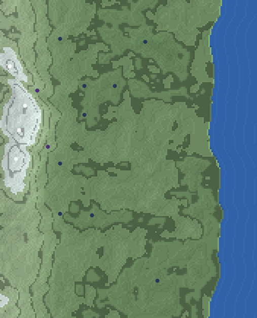

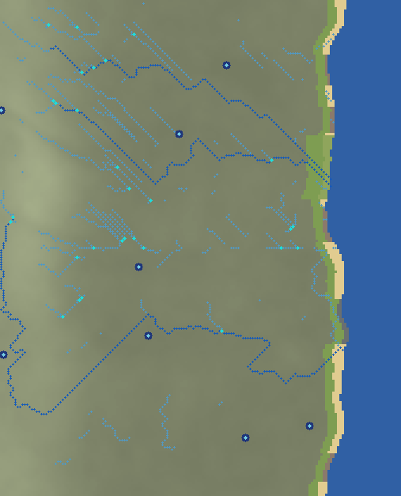

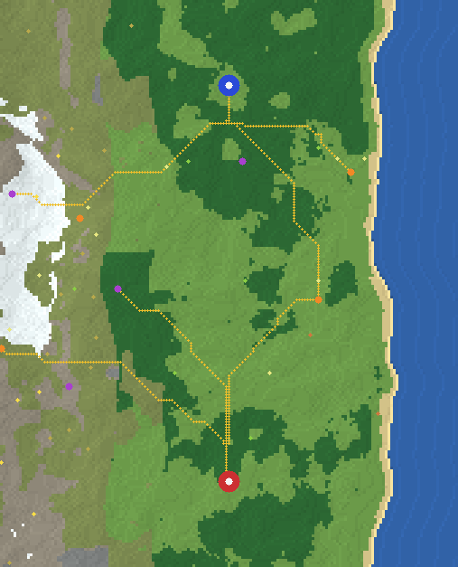

- Geographic identity: split spine with western depth 310 blocks and Y61–105.
- Hydrological terrain: 5 principal potential channels, 29 network junctions, 8 collection basins, and 10 coast outlets; mean principal sinuosity 1.525, heading-run fraction 0.2091; no water blocks or finished rivers.
- Coast: 4 shore characters, width 7–24 blocks, sinuosity 1.0352, with 27 headland/cove turns.
- Forest/open space: 7 substantial regions, 70 block maximum interior, 41 embedded clearing cells; empty/deep-off-Route 46.2%/36.9%.
- Routes and opportunities: six curved analytical corridors, straight-run diagnostic 0.293; 14 village/POI location markers average 81.4% locally developable area. Packing hotspot 7; opportunity bias 0.114.
- Previously visible defects: terrain bands reduced=improved, macro grade contains medium relief=improved, forest edges fragmented=improved, drainage is terrain not water stamp=improved, drainage has relationships=improved, principal drainage not one straight trace=improved, coast not uniform ribbon=improved, routes not cardinal polylines=improved.
- Strongest reason to keep: divided ridge system with distinct crossing choices.
- Strongest reason to reject: forest boundaries remain locally regular.

### 920261024 — twin_massif

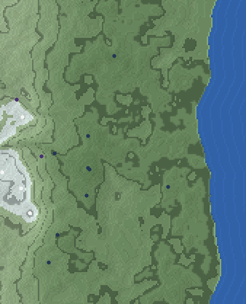

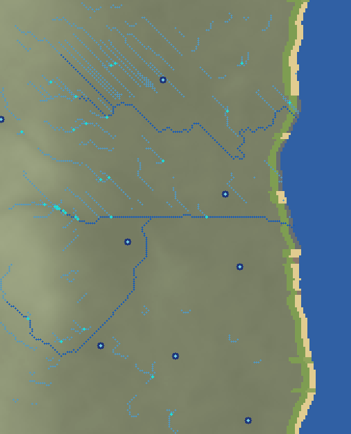

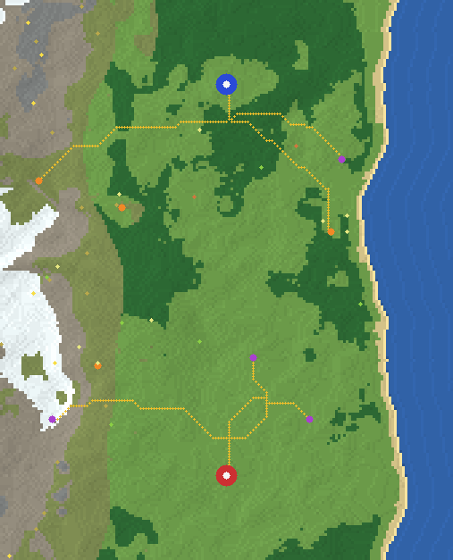

- Geographic identity: twin massif with western depth 315 blocks and Y56–101.
- Hydrological terrain: 5 principal potential channels, 33 network junctions, 8 collection basins, and 8 coast outlets; mean principal sinuosity 1.368, heading-run fraction 0.2204; no water blocks or finished rivers.
- Coast: 4 shore characters, width 7–25 blocks, sinuosity 1.0401, with 37 headland/cove turns.
- Forest/open space: 8 substantial regions, 120 block maximum interior, 39 embedded clearing cells; empty/deep-off-Route 49.4%/46.8%.
- Routes and opportunities: six curved analytical corridors, straight-run diagnostic 0.223; 14 village/POI location markers average 84.6% locally developable area. Packing hotspot 8; opportunity bias 0.146.
- Previously visible defects: terrain bands reduced=improved, macro grade contains medium relief=improved, forest edges fragmented=improved, drainage is terrain not water stamp=improved, drainage has relationships=improved, principal drainage not one straight trace=improved, coast not uniform ribbon=improved, routes not cardinal polylines=improved.
- Strongest reason to keep: two readable western highland districts and substantial connective space.
- Strongest reason to reject: forest boundaries remain locally regular.

### 920261046 — offset_basin

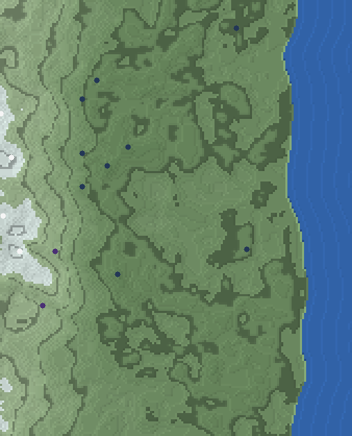

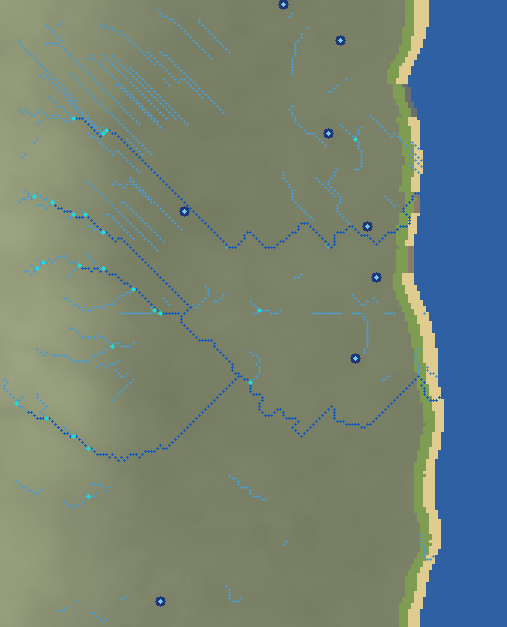

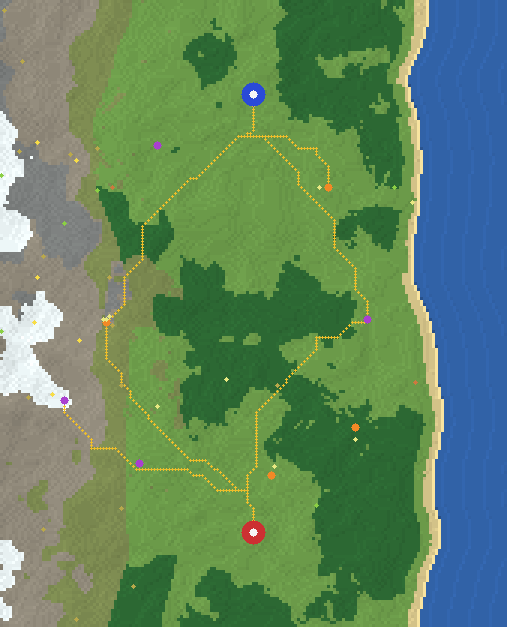

- Geographic identity: offset basin with western depth 320 blocks and Y59–98.
- Hydrological terrain: 5 principal potential channels, 24 network junctions, 8 collection basins, and 9 coast outlets; mean principal sinuosity 1.45, heading-run fraction 0.174; no water blocks or finished rivers.
- Coast: 3 shore characters, width 7–22 blocks, sinuosity 1.0293, with 25 headland/cove turns.
- Forest/open space: 7 substantial regions, 90 block maximum interior, 73 embedded clearing cells; empty/deep-off-Route 46.8%/43.5%.
- Routes and opportunities: six curved analytical corridors, straight-run diagnostic 0.196; 14 village/POI location markers average 83.5% locally developable area. Packing hotspot 9; opportunity bias 0.070.
- Previously visible defects: terrain bands reduced=improved, macro grade contains medium relief=improved, forest edges fragmented=improved, drainage is terrain not water stamp=improved, drainage has relationships=improved, principal drainage not one straight trace=improved, coast not uniform ribbon=improved, routes not cardinal polylines=improved.
- Strongest reason to keep: offset interior basin and contrasting Route enclosure.
- Strongest reason to reject: analytical opportunity packing is near the experimental ceiling.

### 920261031 — sawtooth_valleys

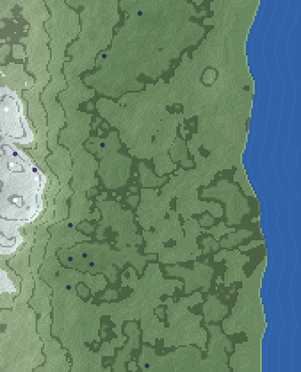

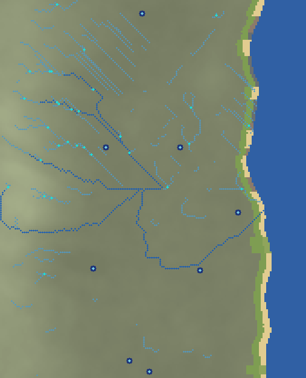

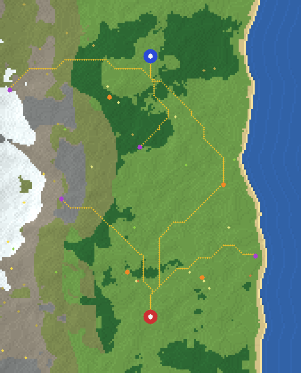

- Geographic identity: sawtooth valleys with western depth 330 blocks and Y58–106.
- Hydrological terrain: 5 principal potential channels, 33 network junctions, 8 collection basins, and 8 coast outlets; mean principal sinuosity 1.637, heading-run fraction 0.1039; no water blocks or finished rivers.
- Coast: 4 shore characters, width 7–21 blocks, sinuosity 1.0358, with 20 headland/cove turns.
- Forest/open space: 9 substantial regions, 95 block maximum interior, 35 embedded clearing cells; empty/deep-off-Route 41.5%/39.8%.
- Routes and opportunities: six curved analytical corridors, straight-run diagnostic 0.242; 14 village/POI location markers average 89.1% locally developable area. Packing hotspot 6; opportunity bias 0.195.
- Previously visible defects: terrain bands reduced=improved, macro grade contains medium relief=improved, forest edges fragmented=improved, drainage is terrain not water stamp=improved, drainage has relationships=improved, principal drainage not one straight trace=improved, coast not uniform ribbon=improved, routes not cardinal polylines=improved.
- Strongest reason to keep: repeated internal valleys without reverting to a western wall.
- Strongest reason to reject: North/South opportunity portfolio asymmetry is comparatively high.

### 920261043 — broken_peaks

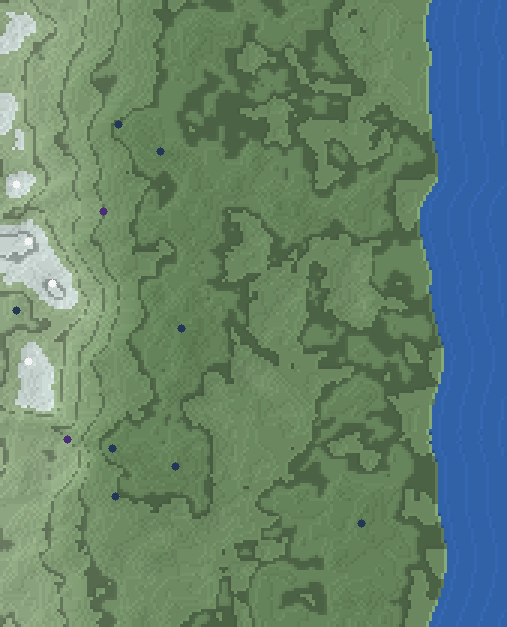

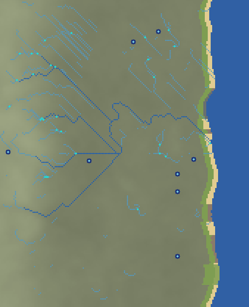

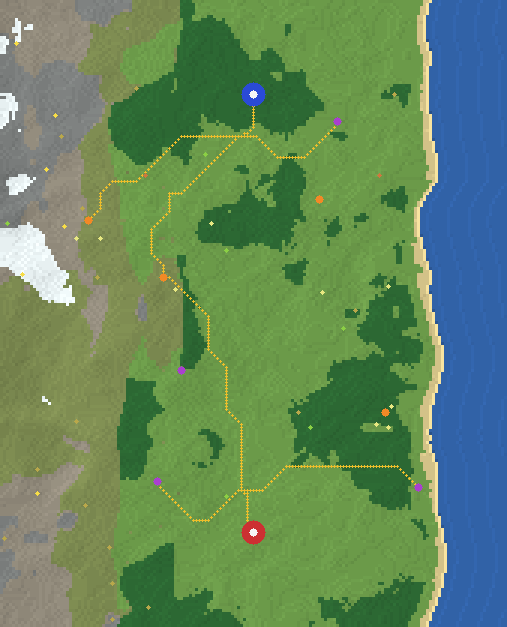

- Geographic identity: broken peaks with western depth 305 blocks and Y58–98.
- Hydrological terrain: 5 principal potential channels, 31 network junctions, 8 collection basins, and 8 coast outlets; mean principal sinuosity 1.568, heading-run fraction 0.208; no water blocks or finished rivers.
- Coast: 4 shore characters, width 7–25 blocks, sinuosity 1.032, with 26 headland/cove turns.
- Forest/open space: 12 substantial regions, 80 block maximum interior, 32 embedded clearing cells; empty/deep-off-Route 40.6%/49.2%.
- Routes and opportunities: six curved analytical corridors, straight-run diagnostic 0.304; 14 village/POI location markers average 93.0% locally developable area. Packing hotspot 6; opportunity bias 0.152.
- Previously visible defects: terrain bands reduced=improved, macro grade contains medium relief=improved, forest edges fragmented=improved, drainage is terrain not water stamp=improved, drainage has relationships=improved, principal drainage not one straight trace=improved, coast not uniform ribbon=improved, routes not cardinal polylines=improved.
- Strongest reason to keep: fragmented western landmarks and strong forest/open alternation.
- Strongest reason to reject: some west/east landcover structure remains legible.

### 920261029 — highland_ravines

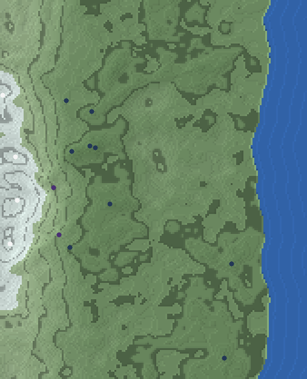

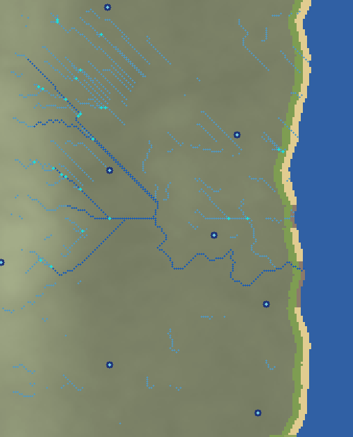

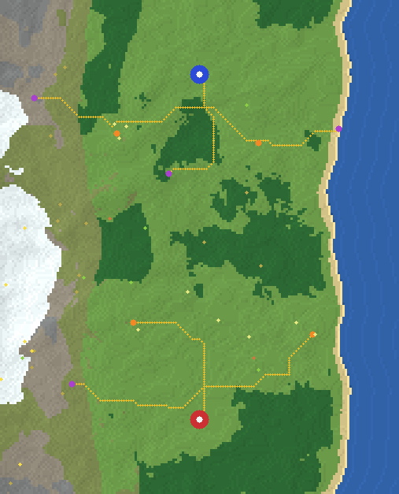

- Geographic identity: highland ravines with western depth 325 blocks and Y57–106.
- Hydrological terrain: 5 principal potential channels, 26 network junctions, 8 collection basins, and 5 coast outlets; mean principal sinuosity 1.446, heading-run fraction 0.1782; no water blocks or finished rivers.
- Coast: 3 shore characters, width 7–28 blocks, sinuosity 1.0349, with 31 headland/cove turns.
- Forest/open space: 8 substantial regions, 95 block maximum interior, 39 embedded clearing cells; empty/deep-off-Route 43.8%/43.0%.
- Routes and opportunities: six curved analytical corridors, straight-run diagnostic 0.268; 14 village/POI location markers average 84.7% locally developable area. Packing hotspot 8; opportunity bias 0.098.
- Previously visible defects: terrain bands reduced=improved, macro grade contains medium relief=improved, forest edges fragmented=improved, drainage is terrain not water stamp=improved, drainage has relationships=improved, principal drainage not one straight trace=improved, coast not uniform ribbon=improved, routes not cardinal polylines=improved.
- Strongest reason to keep: negative-relief mountain structure and catchment opportunities.
- Strongest reason to reject: some west/east landcover structure remains legible.

## Regression references

### 920261010 — regenerated horseshoe

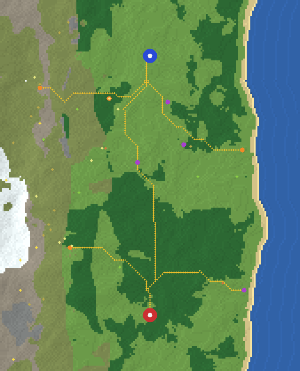

The v2 seed is intentionally not output-identical to its v1 world. It passes 8/8 visible-defect screens. Its hydrology is now unmodified D8 catchment terrain with 34 tributary junctions and 8 basins; coast width CV is 0.252; forest-edge straightness is 0.664; Route straight-run diagnostic is 0.256. Remaining warnings: none in the current experimental screens.

### 920261022 — regenerated offset_basin

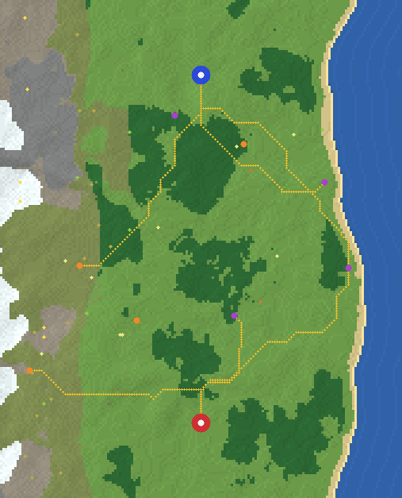

The v2 seed is intentionally not output-identical to its v1 world. It passes 8/8 visible-defect screens. Its hydrology is now unmodified D8 catchment terrain with 46 tributary junctions and 8 basins; coast width CV is 0.268; forest-edge straightness is 0.662; Route straight-run diagnostic is 0.249. Remaining warnings: none in the current experimental screens.

## Comparison with the serialized v1 worlds

The v2 regression renders preserve the horseshoe and offset-basin seed identities without preserving their exact v1 geometry. Domain-warped overlapping relief replaces conspicuous macro/material bands; medium and small relief now interrupts the westward grade; forest edges interlock and contain clearings; coast width and shore character vary by row; and terrain-cost Routes use diagonals plus curve refinement instead of cardinal/right-angle centerlines. Hydrology is no longer physicalized as static water or lava: priority-flood catchments, spills, minima, basins, accumulation, tributaries, and possible coast outlets are evaluated over an unchanged heightfield.

These are source-generator improvements, not palette fixes. The pass deliberately does not test whether any channel will behave like vanilla water, whether markers deserve structures, or whether a provisional corridor should become a constructed Route.

## Remaining visible generator defects

- D8 accumulation still exposes occasional cardinal/diagonal runs and parallel western traces. Principal paths are screened for excessive straightness, but later hydrology needs sub-cell channel shaping and Minecraft water-behavior tests.
- The east remains one continuous ocean boundary. Coves, headlands, flats, shore types, and widths now vary, but estuary/delta behavior and erosion are only opportunities, not simulations.
- Some candidates retain legible west/east landcover organization, and topology families can read more clearly in metrics than at whole-map thumbnail scale.
- Routes are smoothed 5-block terrain-cost polylines. They are less angular than v1 but still analytical centerlines, with no corridor-width, crossing, bridge, or final segment-language decisions.
- Forests are spatial regions rather than trees; opportunity suitability is local 2D relief/developability rather than block-scale sight-line or construction testing.

## Known limits

This pass can compare heightfield structure, slope, catchments, potential channels, coast morphology, forest regions, corridor geometry, packing, and opportunity location context. It cannot prove vanilla water behavior, cave quality, sight lines, Minecraft block-scale traversal, resource extraction, final Route construction, or gameplay balance. Experimental screens describe visible generator risks; they are not new canonical design thresholds.

Stop condition reached: review these greyboxes before any further Minecraft serialization.
