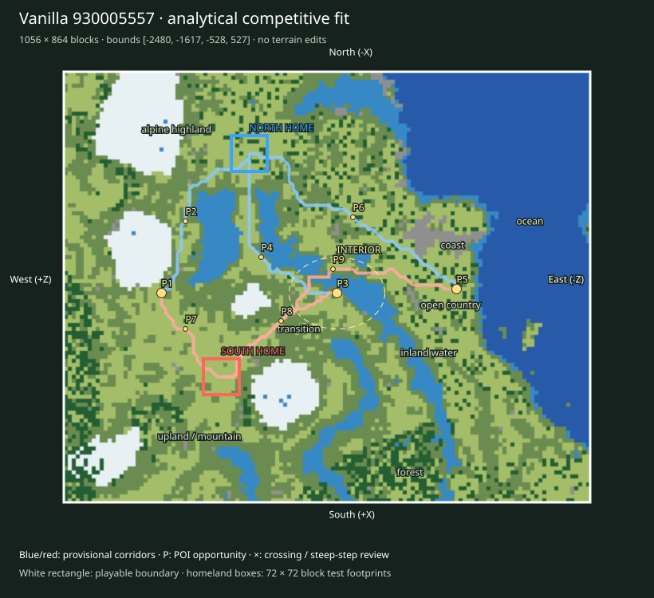

# Finalist 930005557

> Prototype/test: real vanilla substrate plus analytical fit, not a selected or balanced map.

World: `/Users/iracarranza/minecraftmoba/artifacts/worldgen/staged_default_2026-09-09/worlds/Default_930005557_-2048_0`. Java 1.21.11.
Bounds (inclusive xmin,xmax,zmin,zmax): `[-2480, -1617, -528, 527]`; source center `[-2048, 0]`.
Logical axes: `{'East': '-Z', 'West': '+Z', 'South': '+X', 'North': '-X'}`.

Survival rationale: eastern ocean 56.2%, western highland 56.9%, 1204 western cold highland samples, open ground 41.3%. These are actual chunk samples, not cheap biome predictions.

Macro composition and orientability: western highland core diameter proxy 256 blocks; terrain Y [21, 164]; canopy 7.1%; largest dry component 99.3% of dry land. Snow/elevation and coast/water provide complementary W/E cues; homeland infrastructure supplies N/S identity later.

Center: [-2036, -20], a provisional junction area. Three shared regional destinations span 592 blocks; this is a topology hypothesis, not evidence that the center must be a single objective.

Landscape and formation relationships (actual sampled adjacency):

- alpine highland-1: 29,568 blocks² near [-2380, 372]; neighbors: upland / mountain, inland water, transition.
- alpine highland-2: 14,272 blocks² near [-2124, 372]; neighbors: transition, upland / mountain, inland water.
- coast-1: 6,272 blocks² near [-2148, -228]; neighbors: transition, open country, inland water.
- coast-2: 1,088 blocks² near [-2452, -116]; neighbors: transition, ocean, inland water, open country.
- forest-1: 19,328 blocks² near [-1692, -140]; neighbors: upland / mountain, open country, inland water, transition.
- forest-2: 7,744 blocks² near [-1964, 492]; neighbors: open country, upland / mountain, transition.
- inland water-1: 16,256 blocks² near [-1932, -148]; neighbors: transition, forest, open country.
- inland water-2: 12,928 blocks² near [-2156, 220]; neighbors: transition, open country.
- ocean-1: 176,576 blocks² near [-2196, -380]; neighbors: transition, inland water, coast, forest, open country.
- open country-1: 64,000 blocks² near [-2028, -188]; neighbors: forest, transition, inland water, coast, upland / mountain.
- open country-2: 29,440 blocks² near [-1932, 260]; neighbors: transition, upland / mountain.
- transition-1: 33,856 blocks² near [-1980, 100]; neighbors: open country, upland / mountain, alpine highland, inland water, forest.
- transition-2: 15,616 blocks² near [-2236, 148]; neighbors: upland / mountain, open country, inland water.
- upland / mountain-1: 59,776 blocks² near [-1764, 340]; neighbors: transition, alpine highland, open country, forest, inland water.
- upland / mountain-2: 59,008 blocks² near [-2340, 292]; neighbors: open country, transition, alpine highland, inland water.

Homeland fit:

- north: [-2316, 156], footprint [-2352, -2281, 120, 191], developable 91.4%, Y range [85, 95], canopy 17.3%.
- south: [-1868, 212], footprint [-1904, -1833, 176, 247], developable 76.5%, Y range [88, 102], canopy 0.0%.

Homeland separation: 451 blocks. Unproven: terrain site fractions only; resource portfolios, practical travel and defenses remain review criteria.

Route fit (six provisional corridor relationships, not finished roads):

- north-route-1 → western_highland_approach: 390 blocks, 0 water samples, maximum 8-block sampled elevation step 6 Y; 0 edges exceed 8 Y.
- north-route-2 → central_wilderness: 416 blocks, 0 water samples, maximum 8-block sampled elevation step 6 Y; 0 edges exceed 8 Y.
- north-route-3 → eastern_coast_approach: 561 blocks, 0 water samples, maximum 8-block sampled elevation step 5 Y; 0 edges exceed 8 Y.
- south-route-1 → western_highland_approach: 236 blocks, 0 water samples, maximum 8-block sampled elevation step 3 Y; 0 edges exceed 8 Y.
- south-route-2 → central_wilderness: 325 blocks, 0 water samples, maximum 8-block sampled elevation step 3 Y; 0 edges exceed 8 Y.
- south-route-3 → eastern_coast_approach: 632 blocks, 0 water samples, maximum 8-block sampled elevation step 7 Y; 0 edges exceed 8 Y.

POI opportunities:

- P1: major, western_highland_approach, [-2036, 332]; north-route-1.
- P2: minor, staging / discovery opportunity, [-2180, 284]; north-route-1.
- P3: major, central_wilderness, [-2036, -20]; north-route-2.
- P4: minor, staging / discovery opportunity, [-2108, 132]; north-route-2.
- P5: major, eastern_coast_approach, [-2044, -260]; north-route-3.
- P6: minor, staging / discovery opportunity, [-2188, -52]; north-route-3.
- P7: minor, staging / discovery opportunity, [-1964, 284]; south-route-1.
- P8: minor, staging / discovery opportunity, [-1980, 92]; south-route-2.
- P9: minor, staging / discovery opportunity, [-2084, -12]; south-route-3.

Principal weakness: One paired regional corridor has a 1.65× length imbalance; endpoint or homeland placement needs review. Largest open patch: 70,016 blocks².

Correction burden: Elevated local access/topology review. Local access/vegetation/infrastructure expected. No macro terrain replacement proposed. Reject after manual review if corridor stairs, bridges or homeland grading require major repair.

Paired regional Route lengths (diagnostic, not fairness scores):

- western_highland_approach: N 390 / S 236 blocks; ratio 1.653.
- central_wilderness: N 416 / S 325 blocks; ratio 1.28.
- eastern_coast_approach: N 561 / S 632 blocks; ratio 1.127.

Manual criteria: interior regional legibility and sightlines; mountain passes/valleys and exposed caves; crossing alternatives; homeland usable floor area and access; practical two-team Route equivalence; expedition travel. Structure starts and underground palettes are recorded separately and are not POI placements.

Open the clean world in Minecraft Java 1.21.11; use `INSPECTION.json` for spawn and raw coordinate navigation. The labeled SVG defines logical north at the top and the complete intended boundary. Adjacent generated chunks are outside the evaluated playable area.
