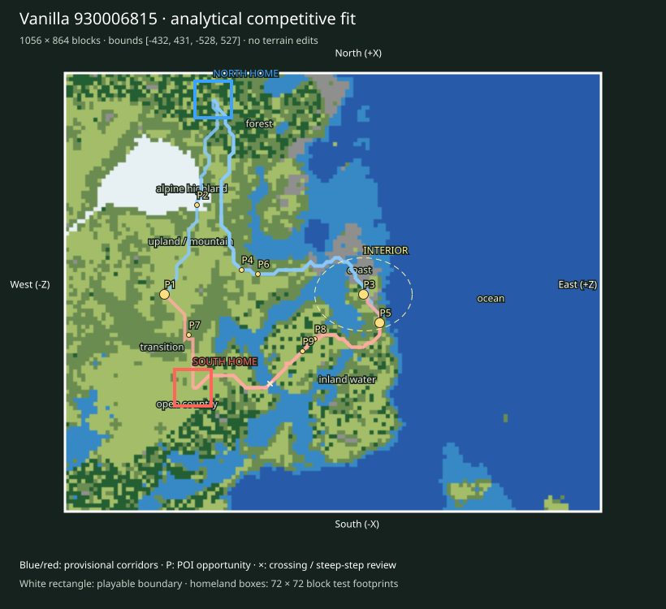

# Finalist 930006815

> Prototype/test: real vanilla substrate plus analytical fit, not a selected or balanced map.

World: `/Users/iracarranza/minecraftmoba/artifacts/worldgen/staged_default_2026-09-09/worlds/Default_930006815_0_0`. Java 1.21.11.
Bounds (inclusive xmin,xmax,zmin,zmax): `[-432, 431, -528, 527]`; source center `[0, 0]`.
Logical axes: `{'East': '+Z', 'West': '-Z', 'South': '-X', 'North': '+X'}`.

Survival rationale: eastern ocean 95.7%, western highland 41.2%, 382 western cold highland samples, open ground 43.4%. These are actual chunk samples, not cheap biome predictions.

Macro composition and orientability: western highland core diameter proxy 384 blocks; terrain Y [27, 154]; canopy 6.1%; largest dry component 98.8% of dry land. Snow/elevation and coast/water provide complementary W/E cues; homeland infrastructure supplies N/S identity later.

Center: [-4, 60], a provisional junction area. Three shared regional destinations span 428 blocks; this is a topology hypothesis, not evidence that the center must be a single objective.

Landscape and formation relationships (actual sampled adjacency):

- alpine highland-1: 23,808 blocks² near [220, -348]; neighbors: upland / mountain.
- coast-1: 7,744 blocks² near [60, 28]; neighbors: inland water, open country, transition.
- coast-2: 3,136 blocks² near [188, -68]; neighbors: open country, inland water, transition.
- forest-1: 27,904 blocks² near [348, -172]; neighbors: upland / mountain, open country, inland water, transition, coast.
- forest-2: 24,448 blocks² near [-332, -340]; neighbors: transition, open country, inland water.
- inland water-1: 31,680 blocks² near [-156, -28]; neighbors: transition, open country, coast, ocean, forest.
- inland water-2: 29,440 blocks² near [148, -12]; neighbors: coast, ocean, open country, transition.
- ocean-1: 393,984 blocks² near [4, 284]; neighbors: inland water, coast, open country, transition.
- ocean-2: 2,304 blocks² near [116, -28]; neighbors: inland water.
- open country-1: 46,848 blocks² near [-204, -348]; neighbors: transition, forest, inland water.
- open country-2: 11,968 blocks² near [-116, -60]; neighbors: transition, inland water.
- transition-1: 16,832 blocks² near [-92, -380]; neighbors: upland / mountain, open country, inland water.
- transition-2: 10,560 blocks² near [-148, 52]; neighbors: inland water, open country, coast, ocean.
- upland / mountain-1: 99,008 blocks² near [116, -364]; neighbors: transition, alpine highland, open country, forest.
- upland / mountain-2: 1,536 blocks² near [380, -4]; neighbors: coast, inland water, forest, open country.

Homeland fit:

- north: [380, -236], footprint [344, 415, -272, -201], developable 63.0%, Y range [85, 95], canopy 53.1%.
- south: [-188, -276], footprint [-224, -153, -312, -241], developable 86.4%, Y range [63, 72], canopy 4.9%.

Homeland separation: 569 blocks. Unproven: terrain site fractions only; resource portfolios, practical travel and defenses remain review criteria.

Route fit (six provisional corridor relationships, not finished roads):

- north-route-1 → western_highland_approach: 437 blocks, 0 water samples, maximum 8-block sampled elevation step 5 Y; 0 edges exceed 8 Y.
- north-route-2 → central_wilderness: 691 blocks, 0 water samples, maximum 8-block sampled elevation step 5 Y; 0 edges exceed 8 Y.
- north-route-3 → eastern_coast_approach: 760 blocks, 0 water samples, maximum 8-block sampled elevation step 5 Y; 0 edges exceed 8 Y.
- south-route-1 → western_highland_approach: 228 blocks, 0 water samples, maximum 8-block sampled elevation step 8 Y; 0 edges exceed 8 Y.
- south-route-2 → central_wilderness: 549 blocks, 1 water samples, maximum 8-block sampled elevation step 7 Y; 0 edges exceed 8 Y.
- south-route-3 → eastern_coast_approach: 480 blocks, 1 water samples, maximum 8-block sampled elevation step 7 Y; 0 edges exceed 8 Y.

POI opportunities:

- P1: major, western_highland_approach, [-4, -332]; north-route-1.
- P2: minor, staging / discovery opportunity, [172, -268]; north-route-1.
- P3: major, central_wilderness, [-4, 60]; north-route-2.
- P4: minor, staging / discovery opportunity, [44, -180]; north-route-2.
- P5: major, eastern_coast_approach, [-60, 92]; north-route-3.
- P6: minor, staging / discovery opportunity, [36, -148]; north-route-3.
- P7: minor, staging / discovery opportunity, [-84, -284]; south-route-1.
- P8: minor, staging / discovery opportunity, [-92, -36]; south-route-2.
- P9: minor, staging / discovery opportunity, [-116, -60]; south-route-3.

Principal weakness: Maritime area consumes almost half or more of the window, reducing dry Wilderness breadth; One paired regional corridor has a 1.92× length imbalance; endpoint or homeland placement needs review. Largest open patch: 46,848 blocks².

Correction burden: Elevated local access/topology review. Local access/vegetation/infrastructure expected. No macro terrain replacement proposed. Reject after manual review if corridor stairs, bridges or homeland grading require major repair.

Paired regional Route lengths (diagnostic, not fairness scores):

- western_highland_approach: N 437 / S 228 blocks; ratio 1.917.
- central_wilderness: N 691 / S 549 blocks; ratio 1.259.
- eastern_coast_approach: N 760 / S 480 blocks; ratio 1.583.

Manual criteria: interior regional legibility and sightlines; mountain passes/valleys and exposed caves; crossing alternatives; homeland usable floor area and access; practical two-team Route equivalence; expedition travel. Structure starts and underground palettes are recorded separately and are not POI placements.

Open the clean world in Minecraft Java 1.21.11; use `INSPECTION.json` for spawn and raw coordinate navigation. The labeled SVG defines logical north at the top and the complete intended boundary. Adjacent generated chunks are outside the evaluated playable area.
