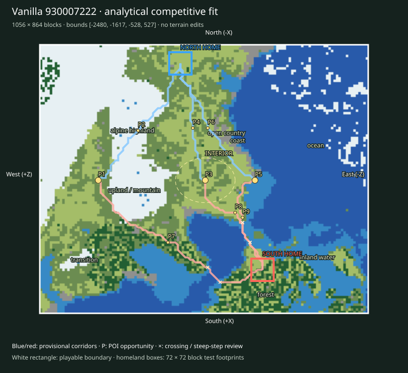

# Finalist 930007222

> Prototype/test: real vanilla substrate plus analytical fit, not a selected or balanced map.

World: `/Users/iracarranza/minecraftmoba/artifacts/worldgen/staged_default_2026-09-09/worlds/Default_930007222_-2048_0`. Java 1.21.11.
Bounds (inclusive xmin,xmax,zmin,zmax): `[-2480, -1617, -528, 527]`; source center `[-2048, 0]`.
Logical axes: `{'East': '-Z', 'West': '+Z', 'South': '+X', 'North': '-X'}`.

Survival rationale: eastern ocean 64.7%, western highland 56.9%, 2063 western cold highland samples, open ground 28.4%. These are actual chunk samples, not cheap biome predictions.

Macro composition and orientability: western highland core diameter proxy 288 blocks; terrain Y [44, 187]; canopy 5.5%; largest dry component 84.9% of dry land. Snow/elevation and coast/water provide complementary W/E cues; homeland infrastructure supplies N/S identity later.

Center: [-2044, -4], a provisional junction area. Three shared regional destinations span 504 blocks; this is a topology hypothesis, not evidence that the center must be a single objective.

Landscape and formation relationships (actual sampled adjacency):

- alpine highland-1: 137,088 blocks² near [-2220, 300]; neighbors: transition, open country, upland / mountain, inland water, forest.
- alpine highland-2: 3,264 blocks² near [-1956, 508]; neighbors: upland / mountain, transition.
- coast-1: 4,928 blocks² near [-2188, -84]; neighbors: open country, inland water, ocean, transition.
- coast-2: 4,352 blocks² near [-2444, -156]; neighbors: open country, ocean, inland water, transition.
- forest-1: 22,464 blocks² near [-1692, -172]; neighbors: open country, inland water, transition, ocean.
- forest-2: 20,672 blocks² near [-1804, 292]; neighbors: transition, open country, inland water, coast, upland / mountain, alpine highland, ocean.
- inland water-1: 51,520 blocks² near [-1812, -308]; neighbors: transition, open country, coast, ocean, forest.
- inland water-2: 22,144 blocks² near [-1740, 124]; neighbors: forest, coast, ocean.
- ocean-1: 215,616 blocks² near [-2172, -332]; neighbors: inland water, coast, transition, alpine highland.
- ocean-2: 54,976 blocks² near [-1700, 44]; neighbors: inland water, transition, forest, coast.
- open country-1: 68,544 blocks² near [-2212, -12]; neighbors: transition, upland / mountain, forest, coast, inland water.
- open country-2: 17,664 blocks² near [-1940, 412]; neighbors: transition, upland / mountain, forest.
- transition-1: 17,536 blocks² near [-1804, 428]; neighbors: open country, inland water, forest, alpine highland, upland / mountain, ocean.
- transition-2: 10,368 blocks² near [-2412, 180]; neighbors: open country, alpine highland, upland / mountain.
- upland / mountain-1: 37,440 blocks² near [-2028, 308]; neighbors: transition, open country, alpine highland, forest.
- upland / mountain-2: 20,992 blocks² near [-2244, 140]; neighbors: alpine highland, open country, transition.

Homeland fit:

- north: [-2420, 76], footprint [-2456, -2385, 40, 111], developable 59.3%, Y range [68, 83], canopy 2.5%.
- south: [-1756, -188], footprint [-1792, -1721, -224, -153], developable 92.6%, Y range [62, 68], canopy 30.9%.

Homeland separation: 715 blocks. Unproven: terrain site fractions only; resource portfolios, practical travel and defenses remain review criteria.

Route fit (six provisional corridor relationships, not finished roads):

- north-route-1 → western_highland_approach: 528 blocks, 0 water samples, maximum 8-block sampled elevation step 8 Y; 0 edges exceed 8 Y.
- north-route-2 → central_wilderness: 432 blocks, 0 water samples, maximum 8-block sampled elevation step 6 Y; 0 edges exceed 8 Y.
- north-route-3 → eastern_coast_approach: 501 blocks, 0 water samples, maximum 8-block sampled elevation step 6 Y; 0 edges exceed 8 Y.
- south-route-1 → western_highland_approach: 723 blocks, 6 water samples, maximum 8-block sampled elevation step 10 Y; 1 edges exceed 8 Y.
- south-route-2 → central_wilderness: 397 blocks, 9 water samples, maximum 8-block sampled elevation step 8 Y; 0 edges exceed 8 Y.
- south-route-3 → eastern_coast_approach: 370 blocks, 9 water samples, maximum 8-block sampled elevation step 8 Y; 0 edges exceed 8 Y.

POI opportunities:

- P1: major, western_highland_approach, [-2044, 340]; north-route-1.
- P2: minor, staging / discovery opportunity, [-2204, 212]; north-route-1.
- P3: major, central_wilderness, [-2044, -4]; north-route-2.
- P4: minor, staging / discovery opportunity, [-2212, 36]; north-route-2.
- P5: major, eastern_coast_approach, [-2044, -164]; north-route-3.
- P6: minor, staging / discovery opportunity, [-2212, -12]; north-route-3.
- P7: minor, staging / discovery opportunity, [-1844, 116]; south-route-1.
- P8: minor, staging / discovery opportunity, [-1940, -100]; south-route-2.
- P9: minor, staging / discovery opportunity, [-1924, -124]; south-route-3.

Principal weakness: The longest sampled water crossing spans about 72 blocks; consider a shore detour before proposing a bridge. Largest open patch: 70,848 blocks².

Correction burden: Elevated local access/topology review. Local access/vegetation/infrastructure expected. No macro terrain replacement proposed. Reject after manual review if corridor stairs, bridges or homeland grading require major repair.

Paired regional Route lengths (diagnostic, not fairness scores):

- western_highland_approach: N 528 / S 723 blocks; ratio 1.369.
- central_wilderness: N 432 / S 397 blocks; ratio 1.088.
- eastern_coast_approach: N 501 / S 370 blocks; ratio 1.354.

Manual criteria: interior regional legibility and sightlines; mountain passes/valleys and exposed caves; crossing alternatives; homeland usable floor area and access; practical two-team Route equivalence; expedition travel. Structure starts and underground palettes are recorded separately and are not POI placements.

Open the clean world in Minecraft Java 1.21.11; use `INSPECTION.json` for spawn and raw coordinate navigation. The labeled SVG defines logical north at the top and the complete intended boundary. Adjacent generated chunks are outside the evaluated playable area.
