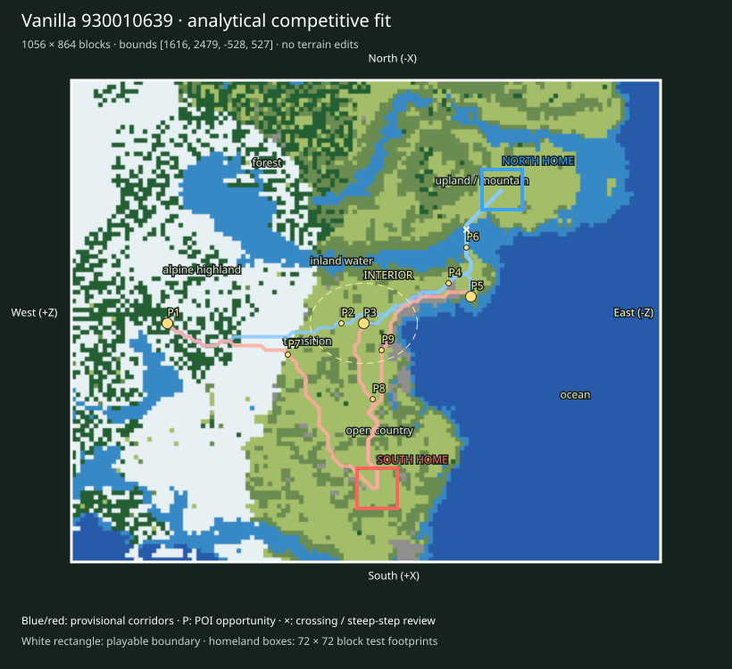

# Finalist 930010639

> Prototype/test: real vanilla substrate plus analytical fit, not a selected or balanced map.

World: `/Users/iracarranza/minecraftmoba/artifacts/worldgen/staged_default_2026-09-09/worlds/Default_930010639_2048_0`. Java 1.21.11.
Bounds (inclusive xmin,xmax,zmin,zmax): `[1616, 2479, -528, 527]`; source center `[2048, 0]`.
Logical axes: `{'East': '-Z', 'West': '+Z', 'South': '+X', 'North': '-X'}`.

Survival rationale: eastern ocean 71.7%, western highland 38.8%, 1809 western cold highland samples, open ground 38.7%. These are actual chunk samples, not cheap biome predictions.

Macro composition and orientability: western highland core diameter proxy 400 blocks; terrain Y [35, 183]; canopy 9.5%; largest dry component 97.0% of dry land. Snow/elevation and coast/water provide complementary W/E cues; homeland infrastructure supplies N/S identity later.

Center: [2052, 4], a provisional junction area. Three shared regional destinations span 546 blocks; this is a topology hypothesis, not evidence that the center must be a single objective.

Landscape and formation relationships (actual sampled adjacency):

- alpine highland-1: 103,936 blocks² near [1940, 364]; neighbors: transition, forest, open country, upland / mountain, inland water.
- alpine highland-2: 11,712 blocks² near [2084, 484]; neighbors: forest, open country.
- coast-1: 2,368 blocks² near [2124, -60]; neighbors: open country, transition, inland water, ocean.
- coast-2: 2,112 blocks² near [2012, -100]; neighbors: open country, inland water, transition.
- forest-1: 65,408 blocks² near [1748, 204]; neighbors: open country, upland / mountain, alpine highland, inland water, transition.
- forest-2: 22,080 blocks² near [2084, 428]; neighbors: alpine highland, inland water, open country, transition.
- inland water-1: 36,928 blocks² near [1924, 100]; neighbors: forest, transition, open country, coast, ocean.
- inland water-2: 20,864 blocks² near [1780, -380]; neighbors: transition, open country, ocean, coast.
- ocean-1: 242,560 blocks² near [2164, -348]; neighbors: coast, inland water, transition.
- ocean-2: 6,720 blocks² near [2444, 476]; neighbors: forest, inland water, transition.
- open country-1: 99,840 blocks² near [2228, 36]; neighbors: transition, coast, inland water, upland / mountain, alpine highland.
- open country-2: 27,136 blocks² near [1804, -260]; neighbors: transition, inland water, coast.
- transition-1: 14,784 blocks² near [2068, 148]; neighbors: alpine highland, open country, forest, upland / mountain, inland water.
- transition-2: 13,376 blocks² near [1724, -100]; neighbors: open country, inland water, upland / mountain, forest.
- upland / mountain-1: 9,024 blocks² near [1780, -124]; neighbors: transition, forest, open country.
- upland / mountain-2: 8,512 blocks² near [1876, 20]; neighbors: forest, alpine highland, transition, open country.

Homeland fit:

- north: [1812, -244], footprint [1776, 1847, -280, -209], developable 96.3%, Y range [64, 70], canopy 0.0%.
- south: [2348, -20], footprint [2312, 2383, -56, 15], developable 76.5%, Y range [74, 82], canopy 0.0%.

Homeland separation: 581 blocks. Unproven: terrain site fractions only; resource portfolios, practical travel and defenses remain review criteria.

Route fit (six provisional corridor relationships, not finished roads):

- north-route-1 → western_highland_approach: 791 blocks, 5 water samples, maximum 8-block sampled elevation step 7 Y; 0 edges exceed 8 Y.
- north-route-2 → central_wilderness: 406 blocks, 5 water samples, maximum 8-block sampled elevation step 7 Y; 0 edges exceed 8 Y.
- north-route-3 → eastern_coast_approach: 228 blocks, 5 water samples, maximum 8-block sampled elevation step 7 Y; 0 edges exceed 8 Y.
- south-route-1 → western_highland_approach: 566 blocks, 0 water samples, maximum 8-block sampled elevation step 5 Y; 0 edges exceed 8 Y.
- south-route-2 → central_wilderness: 339 blocks, 0 water samples, maximum 8-block sampled elevation step 3 Y; 0 edges exceed 8 Y.
- south-route-3 → eastern_coast_approach: 508 blocks, 0 water samples, maximum 8-block sampled elevation step 3 Y; 0 edges exceed 8 Y.

POI opportunities:

- P1: major, western_highland_approach, [2052, 356]; north-route-1.
- P2: minor, staging / discovery opportunity, [2052, 44]; north-route-1.
- P3: major, central_wilderness, [2052, 4]; north-route-2.
- P4: minor, staging / discovery opportunity, [1980, -148]; north-route-2.
- P5: major, eastern_coast_approach, [2004, -188]; north-route-3.
- P6: minor, staging / discovery opportunity, [1916, -180]; north-route-3.
- P7: minor, staging / discovery opportunity, [2108, 140]; south-route-1.
- P8: minor, staging / discovery opportunity, [2188, -12]; south-route-2.
- P9: minor, staging / discovery opportunity, [2100, -28]; south-route-3.

Principal weakness: One paired regional corridor has a 2.23× length imbalance; endpoint or homeland placement needs review. Largest open patch: 119,872 blocks².

Correction burden: Elevated local access/topology review. Local access/vegetation/infrastructure expected. No macro terrain replacement proposed. Reject after manual review if corridor stairs, bridges or homeland grading require major repair.

Paired regional Route lengths (diagnostic, not fairness scores):

- western_highland_approach: N 791 / S 566 blocks; ratio 1.398.
- central_wilderness: N 406 / S 339 blocks; ratio 1.198.
- eastern_coast_approach: N 228 / S 508 blocks; ratio 2.228.

Manual criteria: interior regional legibility and sightlines; mountain passes/valleys and exposed caves; crossing alternatives; homeland usable floor area and access; practical two-team Route equivalence; expedition travel. Structure starts and underground palettes are recorded separately and are not POI placements.

Open the clean world in Minecraft Java 1.21.11; use `INSPECTION.json` for spawn and raw coordinate navigation. The labeled SVG defines logical north at the top and the complete intended boundary. Adjacent generated chunks are outside the evaluated playable area.
