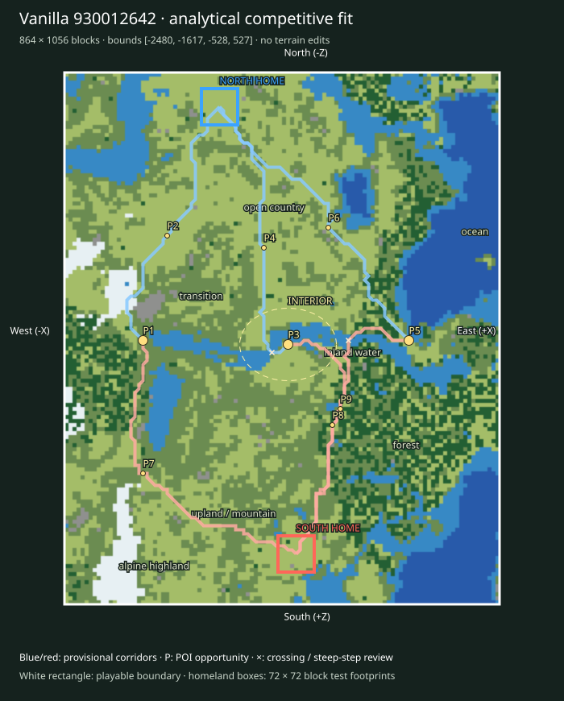

# Finalist 930012642

> Prototype/test: real vanilla substrate plus analytical fit, not a selected or balanced map.

World: `/Users/iracarranza/minecraftmoba/artifacts/worldgen/staged_default_2026-09-09/worlds/Default_930012642_-2048_0`. Java 1.21.11.
Bounds (inclusive xmin,xmax,zmin,zmax): `[-2480, -1617, -528, 527]`; source center `[-2048, 0]`.
Logical axes: `{'East': '+X', 'West': '-X', 'South': '+Z', 'North': '-Z'}`.

Survival rationale: eastern ocean 28.4%, western highland 40.3%, 340 western cold highland samples, open ground 45.3%. These are actual chunk samples, not cheap biome predictions.

Macro composition and orientability: western highland core diameter proxy 320 blocks; terrain Y [4, 149]; canopy 9.5%; largest dry component 93.6% of dry land. Snow/elevation and coast/water provide complementary W/E cues; homeland infrastructure supplies N/S identity later.

Center: [-2036, 12], a provisional junction area. Three shared regional destinations span 528 blocks; this is a topology hypothesis, not evidence that the center must be a single objective.

Landscape and formation relationships (actual sampled adjacency):

- alpine highland-1: 13,056 blocks² near [-2372, 436]; neighbors: upland / mountain.
- alpine highland-2: 3,008 blocks² near [-2460, 148]; neighbors: upland / mountain.
- coast-1: 1,472 blocks² near [-1724, -4]; neighbors: inland water, open country, forest.
- coast-2: 768 blocks² near [-1700, -492]; neighbors: open country, inland water, ocean, transition.
- forest-1: 60,992 blocks² near [-1828, 196]; neighbors: inland water, transition, open country, coast, upland / mountain.
- forest-2: 21,312 blocks² near [-1812, -188]; neighbors: upland / mountain, inland water, open country, ocean, transition.
- inland water-1: 20,160 blocks² near [-1964, 12]; neighbors: forest, open country, transition, upland / mountain.
- inland water-2: 18,304 blocks² near [-1828, -412]; neighbors: open country, transition, forest, upland / mountain, ocean, coast.
- ocean-1: 51,968 blocks² near [-1692, -228]; neighbors: inland water, coast, transition, forest, open country.
- ocean-2: 32,384 blocks² near [-1692, 428]; neighbors: inland water, forest.
- open country-1: 141,376 blocks² near [-2124, -276]; neighbors: inland water, transition, forest.
- open country-2: 17,216 blocks² near [-2044, 436]; neighbors: transition, inland water, upland / mountain.
- transition-1: 63,552 blocks² near [-2252, -100]; neighbors: forest, inland water, upland / mountain, open country, alpine highland.
- transition-2: 11,072 blocks² near [-2404, -452]; neighbors: inland water, open country.
- upland / mountain-1: 105,152 blocks² near [-2228, 332]; neighbors: transition, forest, open country, alpine highland, inland water.
- upland / mountain-2: 28,928 blocks² near [-2412, 92]; neighbors: alpine highland, transition, open country, forest.

Homeland fit:

- north: [-2172, -460], footprint [-2208, -2137, -496, -425], developable 97.5%, Y range [68, 71], canopy 1.2%.
- south: [-2020, 428], footprint [-2056, -1985, 392, 463], developable 90.1%, Y range [65, 72], canopy 1.2%.

Homeland separation: 901 blocks. Unproven: terrain site fractions only; resource portfolios, practical travel and defenses remain review criteria.

Route fit (six provisional corridor relationships, not finished roads):

- north-route-1 → western_highland_approach: 569 blocks, 0 water samples, maximum 8-block sampled elevation step 8 Y; 0 edges exceed 8 Y.
- north-route-2 → central_wilderness: 588 blocks, 1 water samples, maximum 8-block sampled elevation step 7 Y; 0 edges exceed 8 Y.
- north-route-3 → eastern_coast_approach: 675 blocks, 0 water samples, maximum 8-block sampled elevation step 3 Y; 0 edges exceed 8 Y.
- south-route-1 → western_highland_approach: 689 blocks, 0 water samples, maximum 8-block sampled elevation step 8 Y; 0 edges exceed 8 Y.
- south-route-2 → central_wilderness: 556 blocks, 0 water samples, maximum 8-block sampled elevation step 8 Y; 0 edges exceed 8 Y.
- south-route-3 → eastern_coast_approach: 623 blocks, 1 water samples, maximum 8-block sampled elevation step 8 Y; 0 edges exceed 8 Y.

POI opportunities:

- P1: major, western_highland_approach, [-2324, 4]; north-route-1.
- P2: minor, staging / discovery opportunity, [-2276, -204]; north-route-1.
- P3: major, central_wilderness, [-2036, 12]; north-route-2.
- P4: minor, staging / discovery opportunity, [-2084, -180]; north-route-2.
- P5: major, eastern_coast_approach, [-1796, 4]; north-route-3.
- P6: minor, staging / discovery opportunity, [-1956, -220]; north-route-3.
- P7: minor, staging / discovery opportunity, [-2324, 268]; south-route-1.
- P8: minor, staging / discovery opportunity, [-1948, 172]; south-route-2.
- P9: minor, staging / discovery opportunity, [-1932, 140]; south-route-3.

Principal weakness: Coarse ground samples cannot establish block-scale access, interior sightlines or homeland resource equivalence. Largest open patch: 141,376 blocks².

Correction burden: Modest local access/vegetation work provisionally plausible. Local access/vegetation/infrastructure expected. No macro terrain replacement proposed. Reject after manual review if corridor stairs, bridges or homeland grading require major repair.

Paired regional Route lengths (diagnostic, not fairness scores):

- western_highland_approach: N 569 / S 689 blocks; ratio 1.211.
- central_wilderness: N 588 / S 556 blocks; ratio 1.058.
- eastern_coast_approach: N 675 / S 623 blocks; ratio 1.083.

Manual criteria: interior regional legibility and sightlines; mountain passes/valleys and exposed caves; crossing alternatives; homeland usable floor area and access; practical two-team Route equivalence; expedition travel. Structure starts and underground palettes are recorded separately and are not POI placements.

Open the clean world in Minecraft Java 1.21.11; use `INSPECTION.json` for spawn and raw coordinate navigation. The labeled SVG defines logical north at the top and the complete intended boundary. Adjacent generated chunks are outside the evaluated playable area.
