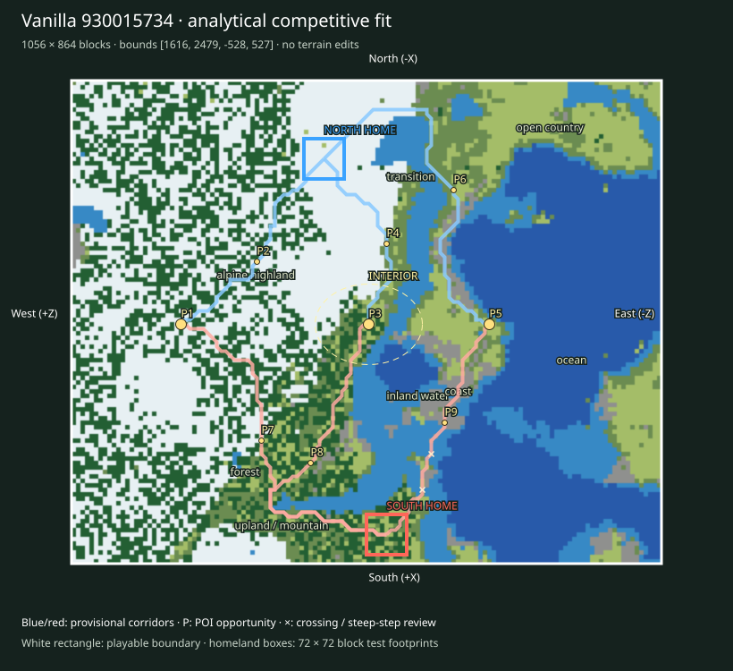

# Finalist 930015734

> Prototype/test: real vanilla substrate plus analytical fit, not a selected or balanced map.

World: `/Users/iracarranza/minecraftmoba/artifacts/worldgen/staged_default_2026-09-09/worlds/Default_930015734_2048_0`. Java 1.21.11.
Bounds (inclusive xmin,xmax,zmin,zmax): `[1616, 2479, -528, 527]`; source center `[2048, 0]`.
Logical axes: `{'East': '-Z', 'West': '+Z', 'South': '+X', 'North': '-X'}`.

Survival rationale: eastern ocean 58.5%, western highland 66.3%, 3053 western cold highland samples, open ground 16.8%. These are actual chunk samples, not cheap biome predictions.

Macro composition and orientability: western highland core diameter proxy 288 blocks; terrain Y [11, 198]; canopy 19.6%; largest dry component 94.3% of dry land. Snow/elevation and coast/water provide complementary W/E cues; homeland infrastructure supplies N/S identity later.

Center: [2052, -4], a provisional junction area. Three shared regional destinations span 552 blocks; this is a topology hypothesis, not evidence that the center must be a single objective.

Landscape and formation relationships (actual sampled adjacency):

- alpine highland-1: 201,024 blocks² near [1948, 268]; neighbors: forest, open country, upland / mountain, transition, inland water.
- alpine highland-2: 23,040 blocks² near [2020, 468]; neighbors: forest, upland / mountain, open country.
- coast-1: 9,088 blocks² near [2156, -140]; neighbors: inland water, open country, transition, ocean.
- coast-2: 3,456 blocks² near [2156, -460]; neighbors: inland water, open country, transition, ocean.
- forest-1: 107,712 blocks² near [2300, 244]; neighbors: alpine highland, open country, upland / mountain, inland water, transition, coast.
- forest-2: 14,592 blocks² near [1932, 396]; neighbors: transition, alpine highland, inland water, open country, coast, upland / mountain.
- inland water-1: 56,576 blocks² near [2164, -36]; neighbors: forest, ocean, coast, open country, transition.
- inland water-2: 14,784 blocks² near [2260, -356]; neighbors: ocean, coast, transition.
- ocean-1: 185,280 blocks² near [2100, -340]; neighbors: inland water, transition, open country, coast.
- ocean-2: 7,104 blocks² near [2132, -68]; neighbors: inland water, coast.
- open country-1: 17,664 blocks² near [1684, -268]; neighbors: transition, inland water.
- open country-2: 13,568 blocks² near [2228, -492]; neighbors: coast, transition.
- transition-1: 50,816 blocks² near [1772, -36]; neighbors: open country, inland water, forest, alpine highland, upland / mountain, coast.
- transition-2: 2,560 blocks² near [1708, -364]; neighbors: inland water, open country.
- upland / mountain-1: 4,352 blocks² near [2396, 236]; neighbors: alpine highland, forest.
- upland / mountain-2: 3,008 blocks² near [2460, 92]; neighbors: open country, forest, alpine highland.

Homeland fit:

- north: [1756, 76], footprint [1720, 1791, 40, 111], developable 100.0%, Y range [87, 92], canopy 0.0%.
- south: [2428, -36], footprint [2392, 2463, -72, -1], developable 70.4%, Y range [67, 75], canopy 51.9%.

Homeland separation: 681 blocks. Unproven: terrain site fractions only; resource portfolios, practical travel and defenses remain review criteria.

Route fit (six provisional corridor relationships, not finished roads):

- north-route-1 → western_highland_approach: 454 blocks, 0 water samples, maximum 8-block sampled elevation step 7 Y; 0 edges exceed 8 Y.
- north-route-2 → central_wilderness: 376 blocks, 0 water samples, maximum 8-block sampled elevation step 6 Y; 0 edges exceed 8 Y.
- north-route-3 → eastern_coast_approach: 703 blocks, 0 water samples, maximum 8-block sampled elevation step 8 Y; 0 edges exceed 8 Y.
- south-route-1 → western_highland_approach: 678 blocks, 0 water samples, maximum 8-block sampled elevation step 7 Y; 0 edges exceed 8 Y.
- south-route-2 → central_wilderness: 654 blocks, 0 water samples, maximum 8-block sampled elevation step 7 Y; 0 edges exceed 8 Y.
- south-route-3 → eastern_coast_approach: 462 blocks, 6 water samples, maximum 8-block sampled elevation step 6 Y; 0 edges exceed 8 Y.

POI opportunities:

- P1: major, western_highland_approach, [2052, 332]; north-route-1.
- P2: minor, staging / discovery opportunity, [1940, 196]; north-route-1.
- P3: major, central_wilderness, [2052, -4]; north-route-2.
- P4: minor, staging / discovery opportunity, [1908, -36]; north-route-2.
- P5: major, eastern_coast_approach, [2052, -220]; north-route-3.
- P6: minor, staging / discovery opportunity, [1812, -156]; north-route-3.
- P7: minor, staging / discovery opportunity, [2260, 188]; south-route-1.
- P8: minor, staging / discovery opportunity, [2300, 100]; south-route-2.
- P9: minor, staging / discovery opportunity, [2228, -140]; south-route-3.

Principal weakness: Open country is relatively scarce; inspect whether forest/alpine terrain leaves sufficient open connective space; The interior is relatively enclosed; junction legibility depends on corridors and edges rather than a broad plain; One paired regional corridor has a 1.74× length imbalance; endpoint or homeland placement needs review. Largest open patch: 17,664 blocks².

Correction burden: Elevated local access/topology review. Local access/vegetation/infrastructure expected. No macro terrain replacement proposed. Reject after manual review if corridor stairs, bridges or homeland grading require major repair.

Paired regional Route lengths (diagnostic, not fairness scores):

- western_highland_approach: N 454 / S 678 blocks; ratio 1.493.
- central_wilderness: N 376 / S 654 blocks; ratio 1.739.
- eastern_coast_approach: N 703 / S 462 blocks; ratio 1.522.

Manual criteria: interior regional legibility and sightlines; mountain passes/valleys and exposed caves; crossing alternatives; homeland usable floor area and access; practical two-team Route equivalence; expedition travel. Structure starts and underground palettes are recorded separately and are not POI placements.

Open the clean world in Minecraft Java 1.21.11; use `INSPECTION.json` for spawn and raw coordinate navigation. The labeled SVG defines logical north at the top and the complete intended boundary. Adjacent generated chunks are outside the evaluated playable area.
