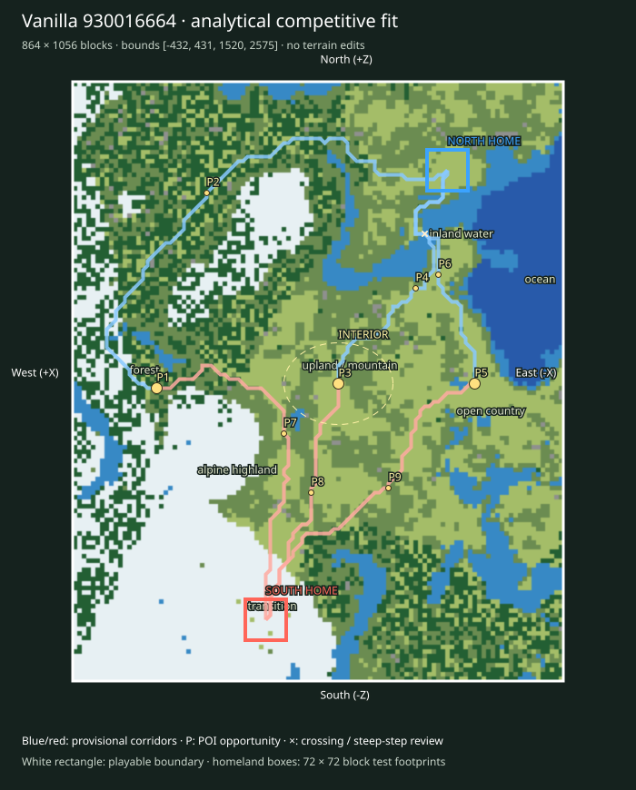

# Finalist 930016664

> Prototype/test: real vanilla substrate plus analytical fit, not a selected or balanced map.

World: `/Users/iracarranza/minecraftmoba/artifacts/worldgen/staged_default_2026-09-09/worlds/Default_930016664_0_2048`. Java 1.21.11.
Bounds (inclusive xmin,xmax,zmin,zmax): `[-432, 431, 1520, 2575]`; source center `[0, 2048]`.
Logical axes: `{'East': '-X', 'West': '+X', 'South': '-Z', 'North': '+Z'}`.

Survival rationale: eastern ocean 15.5%, western highland 41.5%, 1374 western cold highland samples, open ground 27.7%. These are actual chunk samples, not cheap biome predictions.

Macro composition and orientability: western highland core diameter proxy 224 blocks; terrain Y [-11, 182]; canopy 17.8%; largest dry component 100.0% of dry land. Snow/elevation and coast/water provide complementary W/E cues; homeland infrastructure supplies N/S identity later.

Center: [-36, 2044], a provisional junction area. Three shared regional destinations span 560 blocks; this is a topology hypothesis, not evidence that the center must be a single objective.

Landscape and formation relationships (actual sampled adjacency):

- alpine highland-1: 38,144 blocks² near [212, 1908]; neighbors: upland / mountain, inland water, transition, forest, open country.
- alpine highland-2: 31,616 blocks² near [124, 2284]; neighbors: upland / mountain, transition, forest.
- coast-1: 768 blocks² near [-276, 2284]; neighbors: open country, inland water, ocean.
- forest-1: 73,600 blocks² near [332, 2084]; neighbors: transition, inland water, alpine highland, open country, upland / mountain.
- forest-2: 42,624 blocks² near [-236, 1612]; neighbors: open country, inland water, upland / mountain, transition.
- inland water-1: 21,824 blocks² near [-196, 2324]; neighbors: ocean, coast, open country, transition, forest, upland / mountain.
- inland water-2: 18,816 blocks² near [-332, 1764]; neighbors: transition, open country, forest.
- ocean-1: 47,232 blocks² near [-364, 2244]; neighbors: inland water, transition, coast.
- open country-1: 67,456 blocks² near [-244, 2012]; neighbors: inland water, transition, coast, forest, upland / mountain.
- open country-2: 10,112 blocks² near [-372, 1796]; neighbors: inland water, transition, forest.
- transition-1: 36,608 blocks² near [124, 1668]; neighbors: open country, inland water, upland / mountain, alpine highland, forest.
- transition-2: 16,832 blocks² near [332, 1620]; neighbors: forest, alpine highland, inland water.
- upland / mountain-1: 108,416 blocks² near [28, 2092]; neighbors: transition, forest, open country, alpine highland, inland water.
- upland / mountain-2: 22,144 blocks² near [-100, 2500]; neighbors: forest, transition, inland water, open country.

Homeland fit:

- north: [-228, 2420], footprint [-264, -193, 2384, 2455], developable 80.2%, Y range [64, 75], canopy 0.0%.
- south: [92, 1628], footprint [56, 127, 1592, 1663], developable 97.5%, Y range [87, 92], canopy 0.0%.

Homeland separation: 854 blocks. Unproven: terrain site fractions only; resource portfolios, practical travel and defenses remain review criteria.

Route fit (six provisional corridor relationships, not finished roads):

- north-route-1 → western_highland_approach: 998 blocks, 0 water samples, maximum 8-block sampled elevation step 6 Y; 0 edges exceed 8 Y.
- north-route-2 → central_wilderness: 543 blocks, 3 water samples, maximum 8-block sampled elevation step 7 Y; 0 edges exceed 8 Y.
- north-route-3 → eastern_coast_approach: 480 blocks, 3 water samples, maximum 8-block sampled elevation step 5 Y; 0 edges exceed 8 Y.
- south-route-1 → western_highland_approach: 673 blocks, 0 water samples, maximum 8-block sampled elevation step 6 Y; 0 edges exceed 8 Y.
- south-route-2 → central_wilderness: 474 blocks, 0 water samples, maximum 8-block sampled elevation step 6 Y; 0 edges exceed 8 Y.
- south-route-3 → eastern_coast_approach: 639 blocks, 0 water samples, maximum 8-block sampled elevation step 8 Y; 0 edges exceed 8 Y.

POI opportunities:

- P1: major, western_highland_approach, [284, 2036]; north-route-1.
- P2: minor, staging / discovery opportunity, [196, 2380]; north-route-1.
- P3: major, central_wilderness, [-36, 2044]; north-route-2.
- P4: minor, staging / discovery opportunity, [-172, 2212]; north-route-2.
- P5: major, eastern_coast_approach, [-276, 2044]; north-route-3.
- P6: minor, staging / discovery opportunity, [-212, 2236]; north-route-3.
- P7: minor, staging / discovery opportunity, [60, 1956]; south-route-1.
- P8: minor, staging / discovery opportunity, [12, 1852]; south-route-2.
- P9: minor, staging / discovery opportunity, [-124, 1860]; south-route-3.

Principal weakness: Coarse ground samples cannot establish block-scale access, interior sightlines or homeland resource equivalence. Largest open patch: 68,160 blocks².

Correction burden: Modest local access/vegetation work provisionally plausible. Local access/vegetation/infrastructure expected. No macro terrain replacement proposed. Reject after manual review if corridor stairs, bridges or homeland grading require major repair.

Paired regional Route lengths (diagnostic, not fairness scores):

- western_highland_approach: N 998 / S 673 blocks; ratio 1.483.
- central_wilderness: N 543 / S 474 blocks; ratio 1.146.
- eastern_coast_approach: N 480 / S 639 blocks; ratio 1.331.

Manual criteria: interior regional legibility and sightlines; mountain passes/valleys and exposed caves; crossing alternatives; homeland usable floor area and access; practical two-team Route equivalence; expedition travel. Structure starts and underground palettes are recorded separately and are not POI placements.

Open the clean world in Minecraft Java 1.21.11; use `INSPECTION.json` for spawn and raw coordinate navigation. The labeled SVG defines logical north at the top and the complete intended boundary. Adjacent generated chunks are outside the evaluated playable area.
