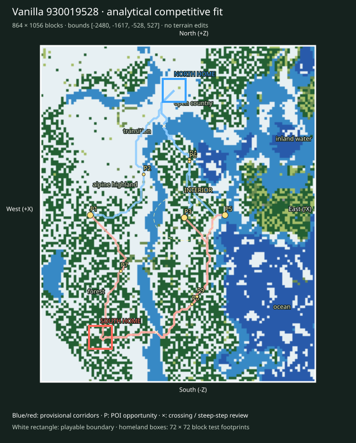

# Finalist 930019528

> Prototype/test: real vanilla substrate plus analytical fit, not a selected or balanced map.

World: `/Users/iracarranza/minecraftmoba/artifacts/worldgen/staged_default_2026-09-09/worlds/Default_930019528_-2048_0`. Java 1.21.11.
Bounds (inclusive xmin,xmax,zmin,zmax): `[-2480, -1617, -528, 527]`; source center `[-2048, 0]`.
Logical axes: `{'East': '-X', 'West': '+X', 'South': '-Z', 'North': '+Z'}`.

Survival rationale: eastern ocean 33.1%, western highland 34.9%, 1657 western cold highland samples, open ground 25.7%. These are actual chunk samples, not cheap biome predictions.

Macro composition and orientability: western highland core diameter proxy 176 blocks; terrain Y [36, 154]; canopy 24.6%; largest dry component 88.9% of dry land. Snow/elevation and coast/water provide complementary W/E cues; homeland infrastructure supplies N/S identity later.

Center: [-2068, -12], a provisional junction area. Three shared regional destinations span 424 blocks; this is a topology hypothesis, not evidence that the center must be a single objective.

Landscape and formation relationships (actual sampled adjacency):

- alpine highland-1: 86,400 blocks² near [-1780, 108]; neighbors: forest, transition, open country, upland / mountain, inland water.
- alpine highland-2: 15,744 blocks² near [-2036, -140]; neighbors: forest, open country, transition, inland water.
- forest-1: 115,200 blocks² near [-1764, -228]; neighbors: alpine highland, open country, inland water, transition, upland / mountain.
- forest-2: 40,704 blocks² near [-2076, -364]; neighbors: inland water, alpine highland, transition, open country, ocean.
- inland water-1: 42,816 blocks² near [-2356, 252]; neighbors: forest, open country, ocean, coast, transition.
- inland water-2: 39,552 blocks² near [-2108, 196]; neighbors: transition, forest, open country, alpine highland, ocean, coast.
- ocean-1: 86,912 blocks² near [-2348, -276]; neighbors: inland water, transition, open country, forest, coast.
- ocean-2: 6,656 blocks² near [-2388, 228]; neighbors: inland water, transition, open country, coast.
- open country-1: 19,648 blocks² near [-2036, 364]; neighbors: transition, forest, inland water.
- open country-2: 15,296 blocks² near [-1740, 484]; neighbors: transition, alpine highland, forest.
- transition-1: 14,528 blocks² near [-1876, 276]; neighbors: inland water, alpine highland, open country.
- transition-2: 6,912 blocks² near [-1940, -92]; neighbors: alpine highland, inland water, open country, forest.

Homeland fit:

- north: [-2036, 388], footprint [-2072, -2001, 352, 423], developable 86.4%, Y range [65, 71], canopy 0.0%.
- south: [-1804, -388], footprint [-1840, -1769, -424, -353], developable 92.6%, Y range [83, 89], canopy 64.2%.

Homeland separation: 810 blocks. Unproven: terrain site fractions only; resource portfolios, practical travel and defenses remain review criteria.

Route fit (six provisional corridor relationships, not finished roads):

- north-route-1 → western_highland_approach: 614 blocks, 0 water samples, maximum 8-block sampled elevation step 5 Y; 0 edges exceed 8 Y.
- north-route-2 → central_wilderness: 489 blocks, 4 water samples, maximum 8-block sampled elevation step 4 Y; 0 edges exceed 8 Y.
- north-route-3 → eastern_coast_approach: 526 blocks, 4 water samples, maximum 8-block sampled elevation step 5 Y; 0 edges exceed 8 Y.
- south-route-1 → western_highland_approach: 464 blocks, 0 water samples, maximum 8-block sampled elevation step 2 Y; 0 edges exceed 8 Y.
- south-route-2 → central_wilderness: 712 blocks, 2 water samples, maximum 8-block sampled elevation step 8 Y; 0 edges exceed 8 Y.
- south-route-3 → eastern_coast_approach: 728 blocks, 2 water samples, maximum 8-block sampled elevation step 8 Y; 0 edges exceed 8 Y.

POI opportunities:

- P1: major, western_highland_approach, [-1772, -4]; north-route-1.
- P2: minor, staging / discovery opportunity, [-1940, 124]; north-route-1.
- P3: major, central_wilderness, [-2068, -12]; north-route-2.
- P4: minor, staging / discovery opportunity, [-2084, 172]; north-route-2.
- P5: major, eastern_coast_approach, [-2196, -4]; north-route-3.
- P6: minor, staging / discovery opportunity, [-2084, 164]; north-route-3.
- P7: minor, staging / discovery opportunity, [-1868, -180]; south-route-1.
- P8: minor, staging / discovery opportunity, [-2092, -284]; south-route-2.
- P9: minor, staging / discovery opportunity, [-2108, -260]; south-route-3.

Principal weakness: Coarse ground samples cannot establish block-scale access, interior sightlines or homeland resource equivalence. Largest open patch: 19,648 blocks².

Correction burden: Modest local access/vegetation work provisionally plausible. Local access/vegetation/infrastructure expected. No macro terrain replacement proposed. Reject after manual review if corridor stairs, bridges or homeland grading require major repair.

Paired regional Route lengths (diagnostic, not fairness scores):

- western_highland_approach: N 614 / S 464 blocks; ratio 1.323.
- central_wilderness: N 489 / S 712 blocks; ratio 1.456.
- eastern_coast_approach: N 526 / S 728 blocks; ratio 1.384.

Manual criteria: interior regional legibility and sightlines; mountain passes/valleys and exposed caves; crossing alternatives; homeland usable floor area and access; practical two-team Route equivalence; expedition travel. Structure starts and underground palettes are recorded separately and are not POI placements.

Open the clean world in Minecraft Java 1.21.11; use `INSPECTION.json` for spawn and raw coordinate navigation. The labeled SVG defines logical north at the top and the complete intended boundary. Adjacent generated chunks are outside the evaluated playable area.
