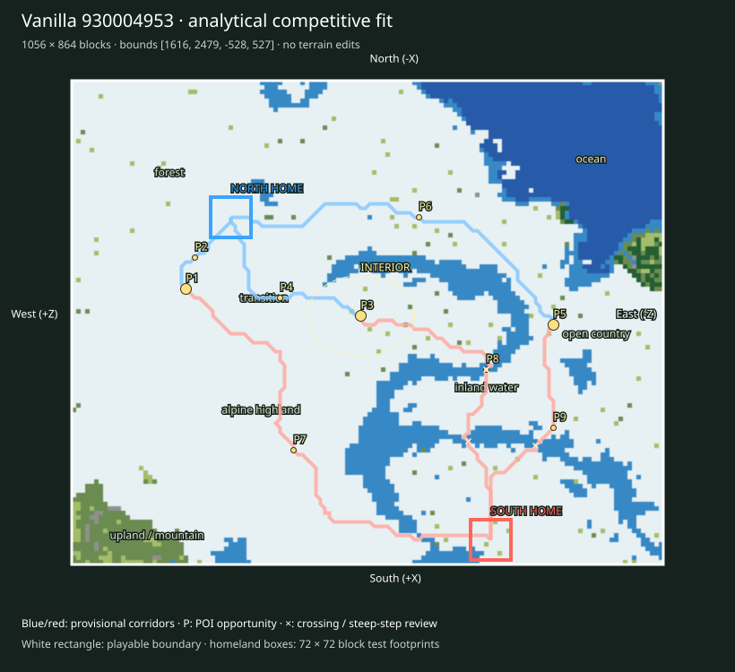

# Finalist 930004953

> Prototype/test: real vanilla substrate plus analytical fit, not a selected or balanced map.

World: `/Users/iracarranza/minecraftmoba/artifacts/worldgen/staged_default_2026-09-09/worlds/Default_930004953_2048_0`. Java 1.21.11.
Bounds (inclusive xmin,xmax,zmin,zmax): `[1616, 2479, -528, 527]`; source center `[2048, 0]`.
Logical axes: `{'East': '-Z', 'West': '+Z', 'South': '+X', 'North': '-X'}`.

Survival rationale: eastern ocean 25.9%, western highland 57.9%, 2533 western cold highland samples, open ground 28.2%. These are actual chunk samples, not cheap biome predictions.

Macro composition and orientability: western highland core diameter proxy 368 blocks; terrain Y [48, 213]; canopy 8.1%; largest dry component 90.0% of dry land. Snow/elevation and coast/water provide complementary W/E cues; homeland infrastructure supplies N/S identity later.

Center: [2036, 12], a provisional junction area. Three shared regional destinations span 659 blocks; this is a topology hypothesis, not evidence that the center must be a single objective.

Landscape and formation relationships (actual sampled adjacency):

- alpine highland-1: 192,064 blocks² near [2188, 260]; neighbors: upland / mountain, transition, forest, open country, inland water.
- alpine highland-2: 84,800 blocks² near [1788, 84]; neighbors: forest, inland water, transition, open country, upland / mountain.
- forest-1: 50,816 blocks² near [1764, 380]; neighbors: open country, alpine highland, transition, inland water.
- forest-2: 18,880 blocks² near [1644, 12]; neighbors: alpine highland, inland water, transition, open country, coast, ocean.
- inland water-1: 56,448 blocks² near [2148, -156]; neighbors: transition, open country, alpine highland, upland / mountain, coast.
- inland water-2: 3,328 blocks² near [1644, 140]; neighbors: forest, open country, transition.
- ocean-1: 81,344 blocks² near [1740, -372]; neighbors: inland water, forest, open country, coast, transition.
- open country-1: 66,752 blocks² near [2052, -348]; neighbors: transition, inland water, forest, coast, ocean, alpine highland.
- open country-2: 46,144 blocks² near [2388, -300]; neighbors: transition, inland water, coast.
- transition-1: 37,184 blocks² near [1988, 228]; neighbors: alpine highland, open country, forest, inland water, upland / mountain.
- transition-2: 26,368 blocks² near [2252, 92]; neighbors: alpine highland, inland water, upland / mountain.
- upland / mountain-1: 13,248 blocks² near [2412, 460]; neighbors: alpine highland, transition.

Homeland fit:

- north: [1860, 244], footprint [1824, 1895, 208, 279], developable 81.5%, Y range [91, 99], canopy 6.2%.
- south: [2436, -220], footprint [2400, 2471, -256, -185], developable 82.7%, Y range [61, 68], canopy 2.5%.

Homeland separation: 740 blocks. Unproven: terrain site fractions only; resource portfolios, practical travel and defenses remain review criteria.

Route fit (six provisional corridor relationships, not finished roads):

- north-route-1 → western_highland_approach: 177 blocks, 0 water samples, maximum 8-block sampled elevation step 8 Y; 0 edges exceed 8 Y.
- north-route-2 → central_wilderness: 368 blocks, 0 water samples, maximum 8-block sampled elevation step 8 Y; 0 edges exceed 8 Y.
- north-route-3 → eastern_coast_approach: 719 blocks, 0 water samples, maximum 8-block sampled elevation step 8 Y; 0 edges exceed 8 Y.
- south-route-1 → western_highland_approach: 885 blocks, 0 water samples, maximum 8-block sampled elevation step 8 Y; 0 edges exceed 8 Y.
- south-route-2 → central_wilderness: 641 blocks, 2 water samples, maximum 8-block sampled elevation step 8 Y; 0 edges exceed 8 Y.
- south-route-3 → eastern_coast_approach: 462 blocks, 1 water samples, maximum 8-block sampled elevation step 3 Y; 0 edges exceed 8 Y.

POI opportunities:

- P1: major, western_highland_approach, [1988, 324]; north-route-1.
- P2: minor, staging / discovery opportunity, [1932, 308]; north-route-1.
- P3: major, central_wilderness, [2036, 12]; north-route-2.
- P4: minor, staging / discovery opportunity, [2004, 156]; north-route-2.
- P5: major, eastern_coast_approach, [2052, -332]; north-route-3.
- P6: minor, staging / discovery opportunity, [1860, -92]; north-route-3.
- P7: minor, staging / discovery opportunity, [2276, 132]; south-route-1.
- P8: minor, staging / discovery opportunity, [2132, -212]; south-route-2.
- P9: minor, staging / discovery opportunity, [2236, -332]; south-route-3.

Principal weakness: One paired regional corridor has a 5.00× length imbalance; endpoint or homeland placement needs review. Largest open patch: 66,752 blocks².

Correction burden: Elevated local access/topology review. Local access/vegetation/infrastructure expected. No macro terrain replacement proposed. Reject after manual review if corridor stairs, bridges or homeland grading require major repair.

Paired regional Route lengths (diagnostic, not fairness scores):

- western_highland_approach: N 177 / S 885 blocks; ratio 5.0.
- central_wilderness: N 368 / S 641 blocks; ratio 1.742.
- eastern_coast_approach: N 719 / S 462 blocks; ratio 1.556.

Manual criteria: interior regional legibility and sightlines; mountain passes/valleys and exposed caves; crossing alternatives; homeland usable floor area and access; practical two-team Route equivalence; expedition travel. Structure starts and underground palettes are recorded separately and are not POI placements.

Open the clean world in Minecraft Java 1.21.11; use `INSPECTION.json` for spawn and raw coordinate navigation. The labeled SVG defines logical north at the top and the complete intended boundary. Adjacent generated chunks are outside the evaluated playable area.
