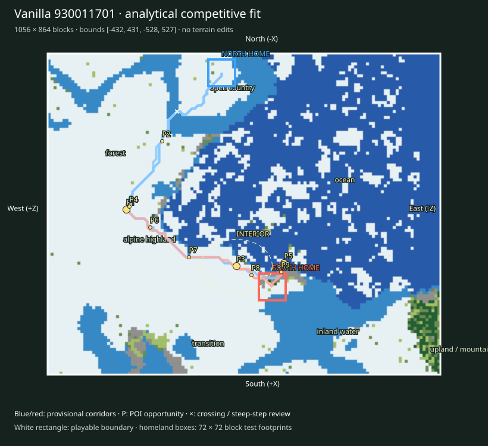

# Finalist 930011701

> Prototype/test: real vanilla substrate plus analytical fit, not a selected or balanced map.

World: `/Users/iracarranza/minecraftmoba/artifacts/worldgen/staged_default_2026-09-09/worlds/Default_930011701_0_0`. Java 1.21.11.
Bounds (inclusive xmin,xmax,zmin,zmax): `[-432, 431, -528, 527]`; source center `[0, 0]`.
Logical axes: `{'East': '-Z', 'West': '+Z', 'South': '+X', 'North': '-X'}`.

Survival rationale: eastern ocean 63.2%, western highland 42.3%, 2008 western cold highland samples, open ground 16.8%. These are actual chunk samples, not cheap biome predictions.

Macro composition and orientability: western highland core diameter proxy 304 blocks; terrain Y [46, 180]; canopy 9.7%; largest dry component 68.9% of dry land. Snow/elevation and coast/water provide complementary W/E cues; homeland infrastructure supplies N/S identity later.

Center: [140, 20], a provisional junction area. Three shared regional destinations span 448 blocks; this is a topology hypothesis, not evidence that the center must be a single objective.

Landscape and formation relationships (actual sampled adjacency):

- alpine highland-1: 111,936 blocks² near [52, 324]; neighbors: forest, open country, transition, ocean, inland water.
- alpine highland-2: 14,400 blocks² near [372, -428]; neighbors: transition, open country, upland / mountain, forest.
- coast-1: 2,624 blocks² near [172, -108]; neighbors: open country, inland water, transition, ocean, forest.
- coast-2: 2,304 blocks² near [396, 188]; neighbors: inland water, open country.
- forest-1: 33,536 blocks² near [-180, 372]; neighbors: inland water, open country, alpine highland, transition, coast.
- forest-2: 27,520 blocks² near [252, 36]; neighbors: alpine highland, inland water, transition, open country, coast.
- inland water-1: 52,672 blocks² near [300, -196]; neighbors: coast, transition, ocean, open country, forest.
- inland water-2: 41,408 blocks² near [-332, 180]; neighbors: transition, open country, coast, ocean, forest.
- ocean-1: 291,776 blocks² near [-108, -244]; neighbors: inland water, transition, coast, open country, alpine highland, forest.
- open country-1: 17,408 blocks² near [-356, 92]; neighbors: transition, inland water.
- open country-2: 6,144 blocks² near [324, 220]; neighbors: coast, inland water, transition.
- transition-1: 24,064 blocks² near [332, 140]; neighbors: open country, forest, inland water, alpine highland.
- transition-2: 21,120 blocks² near [-188, 220]; neighbors: inland water, open country, alpine highland, coast, upland / mountain, ocean, forest.
- upland / mountain-1: 6,272 blocks² near [348, -500]; neighbors: alpine highland, forest, open country.

Homeland fit:

- north: [-380, 60], footprint [-416, -345, 24, 95], developable 67.9%, Y range [62, 72], canopy 2.5%.
- south: [196, -76], footprint [160, 231, -112, -41], developable 69.1%, Y range [62, 74], canopy 7.4%.

Homeland separation: 592 blocks. Unproven: terrain site fractions only; resource portfolios, practical travel and defenses remain review criteria.

Route fit (six provisional corridor relationships, not finished roads):

- north-route-1 → western_highland_approach: 509 blocks, 3 water samples, maximum 8-block sampled elevation step 7 Y; 0 edges exceed 8 Y.
- north-route-2 → central_wilderness: 875 blocks, 3 water samples, maximum 8-block sampled elevation step 7 Y; 0 edges exceed 8 Y.
- north-route-3 → eastern_coast_approach: 1047 blocks, 3 water samples, maximum 8-block sampled elevation step 7 Y; 0 edges exceed 8 Y.
- south-route-1 → western_highland_approach: 497 blocks, 0 water samples, maximum 8-block sampled elevation step 6 Y; 0 edges exceed 8 Y.
- south-route-2 → central_wilderness: 124 blocks, 0 water samples, maximum 8-block sampled elevation step 5 Y; 0 edges exceed 8 Y.
- south-route-3 → eastern_coast_approach: 82 blocks, 0 water samples, maximum 8-block sampled elevation step 7 Y; 0 edges exceed 8 Y.

POI opportunities:

- P1: major, western_highland_approach, [-12, 316]; north-route-1.
- P2: minor, staging / discovery opportunity, [-196, 220]; north-route-1.
- P3: major, central_wilderness, [140, 20]; north-route-2.
- P4: minor, staging / discovery opportunity, [-20, 308]; north-route-2.
- P5: major, eastern_coast_approach, [132, -108]; north-route-3.
- P6: minor, staging / discovery opportunity, [36, 252]; north-route-3.
- P7: minor, staging / discovery opportunity, [116, 148]; south-route-1.
- P8: minor, staging / discovery opportunity, [164, -20]; south-route-2.
- P9: minor, staging / discovery opportunity, [156, -100]; south-route-3.

Principal weakness: Maritime area consumes almost half or more of the window, reducing dry Wilderness breadth; Open country is relatively scarce; inspect whether forest/alpine terrain leaves sufficient open connective space; The interior is relatively enclosed; junction legibility depends on corridors and edges rather than a broad plain; One paired regional corridor has a 12.77× length imbalance; endpoint or homeland placement needs review. Largest open patch: 17,408 blocks².

Correction burden: Elevated local access/topology review. Local access/vegetation/infrastructure expected. No macro terrain replacement proposed. Reject after manual review if corridor stairs, bridges or homeland grading require major repair.

Paired regional Route lengths (diagnostic, not fairness scores):

- western_highland_approach: N 509 / S 497 blocks; ratio 1.024.
- central_wilderness: N 875 / S 124 blocks; ratio 7.056.
- eastern_coast_approach: N 1047 / S 82 blocks; ratio 12.768.

Manual criteria: interior regional legibility and sightlines; mountain passes/valleys and exposed caves; crossing alternatives; homeland usable floor area and access; practical two-team Route equivalence; expedition travel. Structure starts and underground palettes are recorded separately and are not POI placements.

Open the clean world in Minecraft Java 1.21.11; use `INSPECTION.json` for spawn and raw coordinate navigation. The labeled SVG defines logical north at the top and the complete intended boundary. Adjacent generated chunks are outside the evaluated playable area.
