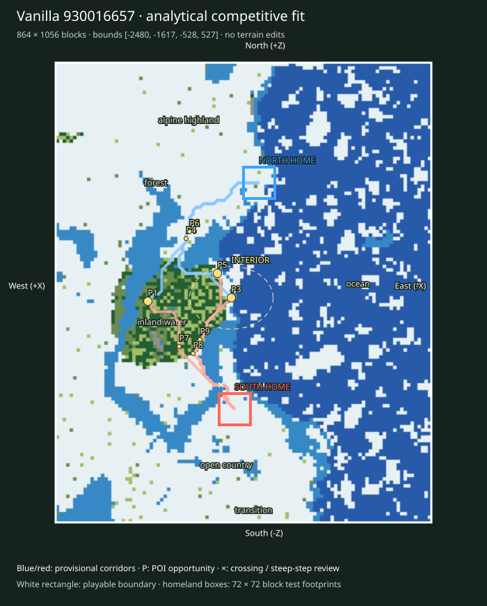

# Finalist 930016657

> Prototype/test: real vanilla substrate plus analytical fit, not a selected or balanced map.

World: `/Users/iracarranza/minecraftmoba/artifacts/worldgen/staged_default_2026-09-09/worlds/Default_930016657_-2048_0`. Java 1.21.11.
Bounds (inclusive xmin,xmax,zmin,zmax): `[-2480, -1617, -528, 527]`; source center `[-2048, 0]`.
Logical axes: `{'East': '-X', 'West': '+X', 'South': '-Z', 'North': '+Z'}`.

Survival rationale: eastern ocean 76.4%, western highland 31.3%, 1477 western cold highland samples, open ground 33.7%. These are actual chunk samples, not cheap biome predictions.

Macro composition and orientability: western highland core diameter proxy 160 blocks; terrain Y [0, 142]; canopy 13.9%; largest dry component 84.9% of dry land. Snow/elevation and coast/water provide complementary W/E cues; homeland infrastructure supplies N/S identity later.

Center: [-2020, -12], a provisional junction area. Three shared regional destinations span 172 blocks; this is a topology hypothesis, not evidence that the center must be a single objective.

Landscape and formation relationships (actual sampled adjacency):

- alpine highland-1: 59,392 blocks² near [-1852, 412]; neighbors: forest, transition.
- alpine highland-2: 29,504 blocks² near [-1684, -68]; neighbors: forest, open country, inland water, upland / mountain.
- coast-1: 768 blocks² near [-2084, 220]; neighbors: inland water, transition, open country, ocean.
- forest-1: 79,040 blocks² near [-1820, 268]; neighbors: upland / mountain, inland water, alpine highland, open country, transition, coast.
- forest-2: 32,064 blocks² near [-1860, -84]; neighbors: inland water, open country, coast.
- inland water-1: 41,728 blocks² near [-1804, -52]; neighbors: forest, open country, transition, ocean, coast.
- inland water-2: 8,896 blocks² near [-1700, -484]; neighbors: transition, open country.
- ocean-1: 320,448 blocks² near [-2284, 36]; neighbors: transition, inland water, coast, open country, alpine highland.
- open country-1: 90,816 blocks² near [-1948, -380]; neighbors: inland water, transition, forest, alpine highland, coast, ocean.
- open country-2: 2,432 blocks² near [-2084, 284]; neighbors: forest, inland water, ocean, coast.
- transition-1: 8,768 blocks² near [-2028, -484]; neighbors: open country, inland water, alpine highland.
- transition-2: 5,376 blocks² near [-2212, -164]; neighbors: ocean, alpine highland.

Homeland fit:

- north: [-2084, 252], footprint [-2120, -2049, 216, 287], developable 55.6%, Y range [48, 71], canopy 22.2%.
- south: [-2028, -268], footprint [-2064, -1993, -304, -233], developable 93.8%, Y range [62, 67], canopy 0.0%.

Homeland separation: 523 blocks. Unproven: terrain site fractions only; resource portfolios, practical travel and defenses remain review criteria.

Route fit (six provisional corridor relationships, not finished roads):

- north-route-1 → western_highland_approach: 439 blocks, 0 water samples, maximum 8-block sampled elevation step 7 Y; 0 edges exceed 8 Y.
- north-route-2 → central_wilderness: 474 blocks, 0 water samples, maximum 8-block sampled elevation step 4 Y; 0 edges exceed 8 Y.
- north-route-3 → eastern_coast_approach: 419 blocks, 0 water samples, maximum 8-block sampled elevation step 4 Y; 0 edges exceed 8 Y.
- south-route-1 → western_highland_approach: 375 blocks, 2 water samples, maximum 8-block sampled elevation step 2 Y; 0 edges exceed 8 Y.
- south-route-2 → central_wilderness: 353 blocks, 2 water samples, maximum 8-block sampled elevation step 1 Y; 0 edges exceed 8 Y.
- south-route-3 → eastern_coast_approach: 402 blocks, 2 water samples, maximum 8-block sampled elevation step 1 Y; 0 edges exceed 8 Y.

POI opportunities:

- P1: major, western_highland_approach, [-1828, -20]; north-route-1.
- P2: minor, staging / discovery opportunity, [-1924, 140]; north-route-1.
- P3: major, central_wilderness, [-2020, -12]; north-route-2.
- P4: minor, staging / discovery opportunity, [-1916, 124]; north-route-2.
- P5: major, eastern_coast_approach, [-1988, 44]; north-route-3.
- P6: minor, staging / discovery opportunity, [-1924, 140]; north-route-3.
- P7: minor, staging / discovery opportunity, [-1900, -124]; south-route-1.
- P8: minor, staging / discovery opportunity, [-1932, -140]; south-route-2.
- P9: minor, staging / discovery opportunity, [-1948, -108]; south-route-3.

Principal weakness: The interior is relatively enclosed; junction legibility depends on corridors and edges rather than a broad plain. Largest open patch: 92,864 blocks².

Correction burden: Modest local access/vegetation work provisionally plausible. Local access/vegetation/infrastructure expected. No macro terrain replacement proposed. Reject after manual review if corridor stairs, bridges or homeland grading require major repair.

Paired regional Route lengths (diagnostic, not fairness scores):

- western_highland_approach: N 439 / S 375 blocks; ratio 1.171.
- central_wilderness: N 474 / S 353 blocks; ratio 1.343.
- eastern_coast_approach: N 419 / S 402 blocks; ratio 1.042.

Manual criteria: interior regional legibility and sightlines; mountain passes/valleys and exposed caves; crossing alternatives; homeland usable floor area and access; practical two-team Route equivalence; expedition travel. Structure starts and underground palettes are recorded separately and are not POI placements.

Open the clean world in Minecraft Java 1.21.11; use `INSPECTION.json` for spawn and raw coordinate navigation. The labeled SVG defines logical north at the top and the complete intended boundary. Adjacent generated chunks are outside the evaluated playable area.
